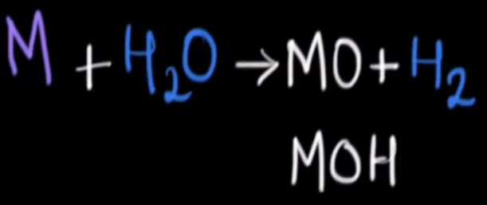

```{r setup, include=FALSE}
knitr::opts_chunk$set(echo = TRUE)
```

# Reeglid oksüdatsiooniastmete jaoks

Oksüdatsiooniaste näitab elektronide loovutamise ja liitmise võimet:

1. Free elements have an oxidation state of zero (e.g. Na, Fe, H2, O2, S8).

2. In an ion the all Oxidation numbers must add up to the charge on the ion.

3. In a neutral compound all Oxidation Numbers must add up to zero.

4. Group 1 = +1

5. Group 2 = +2

6. Hydrogen with Non-Metals = +1

7. Hydrogen with Metals (or Boron) = -1

8. Fluorine = -1

9. Oxygen = -2 (except in H~2~O~2~ or with Fluorine)

10. Group 17(7A) = -1 except with Oxygen and other halogens lower in the group

11. $\underbrace{RH}_{\text{reducing agent}} + \underbrace{NAD^+}_{\text{oxidizing agent}} → \underbrace{NADH}_{\text{reduced}}+\underbrace{R^+}_{oxidized}$

12. $\text{Pyruvic acid} + NADH ↔ \text{lactic acid} + NAD^+$

# Hapnik ja metall

Metal oxides are formed, which are generally basic in nature.

## Hapnik ja aluseline metall

1. $4Li + O_2 -> 2Li_2O$

2. 4 * Na + O~2~ -> 2 * Na~2~O

3. 4 * K + O~2~ -> 2 * K~2~O

4. 2 * Ca + O~2~ -> 2 * CaO

## Hapnik ja mittealuseline metall

1. 2 * Mg + O~2~ -> 2 * MgO

Reaktsioon toimub kõrge temperatuuriga.

2. 4 * Al + 3 * O~2~ -> 2 * Al~2~O~3~

Reaktsioon toimub kõrge temperatuuriga.


3. 2 * Zn + O~2~ -> 2 * ZnO

Reaktsioon toimub kõrge temperatuuriga.

4. $3 \cdot O_2 + 4 \cdot Fe \rightarrow 2 \cdot Fe_2O_3$

# Metall ja elektron

$$Na^+ + e^- \rightarrow Na$$

# Aluseline oksiid ja vesi

1. Li~2~O + H~2~O -> 2 * LiOH

2. Na~2~O + H~2~O -> 2 * NaOH

3. MgO + H~2~O -> Mg(OH)~2~

Reaktsioon toimub osaliselt.

4. K~2~O + H~2~O -> 2 * KOH

5. CaO + H~2~O -> Ca(OH)~2~

# Ülemineku järgse metalli oksiid ja vesi

1. $Al_2O_3 (alumiiniumoksiid) + H_2O$

Ei reageeri. Kui alumiiniumpakend on auruga piiratud söögi ümber, siis ei teki alust, mis võiks söögiga seguneda.

# Vesi ja metalloid

1. H~2~O + SiO~2~

Reaktsioon ei toimu, sest kovalentne side räni ja hapniku vahel on liiga tugev.

# Ülemineku metalli oksiid ja vesi

1. FeO + H~2~O

Ei reageeri.

2. ZnO + H~2~O

Ei reageeri.

# Vesi ja metall




$$2Lm + 2H_2O \rightarrow 2LmOH + H_2$$

Leelismuldmetallid (Ca, Sr, Ba, Ra) reageerivad veega juba toatemperatuuril (Be ja Mg soojendamisel):

$$Lmm + 2H_2O \rightarrow Lmm(OH)_2 + H_2$$

Metal hydroxides are formed:

1. 2 * K + 2 * H~2~O -> K~2~O + H~2~O + H~2~ -> 2 * KOH + H~2~

Selle reaktsiooni kestel eraldub soojus, mis põletab vesiniku ära.

2. $2 \cdot Na + 2 \cdot H_2^IO^{-II} \rightarrow Na_2^{I}O^{-II} + H_2^IO^{-II} + H_2 -> 2 \cdot Na^IO^{-II}H^I + H_2 \uparrow$

Selles reaktsioonis eraldub soojus, mis põletab vesiniku ära.

Na loovutab kaks elektroni olles redutseerija ja oksüdeerub.

3. Ca + 2 * H~2~O -> CaO + H~2~O + H~2~ -> Ca(OH)~2~ + H~2~

Selle reaktsiooni kestel eraldub sooja, mis siiski ei põleta vesinikku ära.

4. 2 * Li + 2 * H~2~O -> Li~2~O + H~2~O + H~2~ -> 2 * LiOH + H~2~

5. Mg + 2 * H~2~O -> MgO + H~2~O + H~2~ -> Mg(OH)~2~ + H~2~

See reaktsioon toimub kõrge temperatuuriga.

6. 2 * Al + 3* H~2~O -> Al~2~O~3~ + 3 * H~2~

Reaktsioon toimub kõrge temperatuuriga. Kui alumiiniumpakend on auruga piiratud söögi ümber, siis ei teki alust, mis võiks söögiga seguneda.

7. Zn + H~2~O -> ZnO + H~2~

Reaktsioon toimub kõrge temperatuuriga.

8. $2Fe + 3H_2^IO^{-II} → (veeaur) Fe_2^{III}O_3^{-II} + 3H_2$

Redoksreaktsioon, sest oksüdatsiooniastmed muutuvad:

Raud on redutseerija, sest loovutab elektrone:

$$Fe - 3 * e \rightarrow Fe^{III}$$

Vesinik on oksüdeerija, sest haagib elektrone:

$$H^I + e \rightarrow H$$

9. 3 * Fe + 4 * H~2~O <-> Fe~3~O~4~ + 4 * H~2~

10. $Ba + 2H_2^{I}O → Ba^{II}(OH)_2 + H_2$

Reaktsioon toimub alati.

See on redoksreaktsioon, sest elementide oksüdatsiooniastmed muutuvad.

Baarium on redutseerija, sest loovutab elektrone:

$$Ba - 2 \cdot e \rightarrow Ba^{II}$$

Vesinik on oksüdeerija, sest hangib elektrone:

$$H^{I} + e \rightarrow H$$

11. Cu + H~2~O

reaktsioon ei toimu, sest vask on selleks liiga nõrk

12. Pb + H~2~O

Reaktsioon ei toimu.

13. Ag + H~2~O

Reaktsioon ei toimu.

14. Au + H~2~O

Reaktsioon ei toimu.

# Vesi ja elektron

Katoodil -:

$$2 \cdot H_2O + 2 \cdot e \rightarrow H_2 + 2 \cdot OH^-$$

Anoodil +:

$$2 \cdot H_2O - 4 \cdot e \rightarrow 4 \cdot H^+ + O_2$$

# Mittemetall ja metall

1. $2 \cdot Na + S \rightarrow Na_2S$

2. K + 2 * S -> K~2~S

# Mittemetallid

## Vesinik ja mittemetall

Covalent hydrides are formed:

1. $2H_2 + O_2 \rightarrow 2H_2^IO^{-II}$

H - 1 * e -> H^+^

H~2~ - 2 * e -> 2H^+^


Hapnik tahab vesinikku rohkem kui teist hapnikku, sest eleketronegatiivsused on erinevamad.


2. $H_2 + F_2 \rightarrow 2HF$


3. H~2~ + Cl~2~ -> 2 * HCl

4. N~2~ + 3 * H~2~ -> 2 * NH~3~ (ammoniaak)

5. H~2~ + S -> H~2~S

## Vesinik ja vesinik

1. $H + H \rightarrow H_2$


2. $H_2 \leftrightarrow 2 \cdot H$

(väga endotermiline) – neelab soojust (vajab palju energiat);
algab alles üle 2000°C; täielikult atomaarne  u 5000°C juures (elektrikaares)

## Hapnik ja mittemetall

Non – metal oxides are formed, which are generally acidic in nature:

1. 2 * C + O~2~ -> 2 * CO

See reaktsioon toimub vähese hapnikuga.

2. C + O~2~ -> CO~2~

See reaktsioon toimub rohke hapnikuga.

2. 4 * P + 5 * O~2~ -> P~4~O~10~

3. $S + O_2 \rightarrow S^{IV}O_2^{-II}$

Hapnik võtab kaks elektroni olles oksüdeerija ja redutseerub. Väävel loovutab neli elektroni olles redutseerija ja oksüdeerub.


4. 2 * S + 3* O~2~ (erinev *3*'st) -> 2 * SO~3~


## Hapnik ja vesinik

1.  $2H_2 + O_2 \leftrightarrow 2H_2O$

    äärmiselt eksotermiline reaktsioon

## Hapnik ja hapnik

1.  $O + O \rightarrow O_2$

    

    

## Muud

1.  $Cl + Cl \rightarrow Cl_2$

    

    

    

    tugev mittepolaarne kovalentne side

    Looduses esineb Cl~2~, mitte Cl, sest nii on stabiilsem.

2. $prooton + H^+ + H_2O \rightarrow H_3O^2$

3. $2H^+ + 2e \rightarrow H_2$

# Vesinik ja metall

Reactive metals from ionic metal hydrides:

1. H~2~ + Li -> 2 * LiH

2. H~2~+ 2 * Na -> 2 * NaH

3. H~2~ + Ca -> CaH~2~

# Vesi ja mittemetall

Generally, do not react:

1. C + H~2~O -> (CO + H~2~) (vesigaas)

See reaktsioon toimub auruga.

2. H~2~O + S

See reaktsioon ei toimu.

# Halogeen ja metall

Metal chalogenides are formed which are ionic in nature:

1. $2 \cdot K + Cl_2 \rightarrow 2 \cdot KCl$


2. 2 * Na + Cl~2~ -> 2 * NaCl

3. 2 * K + Br~2~ -> 2 * KBr

4. Ba + F~2~ -> BaF~2~

5. Ca + Cl~2~ -> CaCl~2~

6. $2 \cdot Fe + 3 \cdot Cl_2 \rightarrow 2 \cdot FeCl_3$

# Aluseline oksiid ja metall

$$4BaO + 2Al \rightarrow BaO \cdot Al_2O_3 + 3Ba$$

# Aluseline oksiid ja mittemetall

1. $Zn^{II}O^{-II} + C \rightarrow Zn + C^{II}O^{-II}$

Süsinik oksüdeerub. Tsink redutseerub.

# Aluselised oksiidid

1. Li~2~O + CaO

Reaktsioon ei toimu.

# Happeline oksiid ja mittemetall

1. $SiO_2 + 2 \cdot C → Si + 2 \cdot CO$

# Happeline oksiid ja vesi

1. $CO  +  H_2O  →  CO_2  + H_2$
(moodustuv CO~2~ eraldatakse pesemisel veega rõhu all)

2. H~2~O + CO~2~ <-> H~2~CO~3~

Kui lisada süsihappe gaasi vette, siis tuleb see anum sättida suure rõhu alla, sest kui sellest me vabastame, laguneb süsihape. Karastusjoogid.

3. $C_6H_{12}O_6 + 6O_2 \leftrightarrow 6CO_2 + 6H_2O + (energia: 18ATP + 12NADPH(3ATP)) + kuumus$

hingamine ja fotosüntees

4. H~2~O + SO~2~ -> H~2~SO~3~

5. SO~3~ + H~2~O -> H~2~SO~4~

6. 6 * H~2~O + P~4~O~10~ -> 4 * H~3~PO~4~

7. $SiO_2 + H_2O$

Reaktsioon ei toimu.

# Happeline oksiid ja alus

1 $2 \cdot NaOH + SO_3 \rightarrow Na_2SO_4 + H_2O$

2. $CO_2 + 2 \cdot NaOH \rightarrow Na_2CO_3 + H_2O$

3. Ca(OH)~2~ + CO~2~ → CaCO~3~ + H~2~O

# Happeline oksiid ja hapnik

1. $2S^{IV}O_2^{-II} + O_2 → 2S^{VI}O_3^{-II}$

Reaktsioon toimub alati.

See on redoksreaktsioon, sest elementide oksüdatsiooniastmed muutuvad.

Väävel on redutseerija, sest loovutab elektrone:

$$S^{IV} - 2 \cdot e \rightarrow S^{VI}$$

Hapnik on oksüdeerija, sest haagib elektrone:

$$O + 2 \cdot e \rightarrow O^{-II}$$

# Happeline oksiid ja aluseline oksiid

1. $SO_2 + Na_2O \rightarrow Na_2SO_3$

2. $SO_3 + Na_2O \rightarrow Na_2SO_4$

3. $SO_3 + MgO → MgSO_4$

Reaktsioon toimub alati.

4. CO~2~ + CaO → CaCO~3~

5. $2Na_2O_2 + \underbrace{2CO_2}_{\text{väljahingatav}} \rightarrow 2Na_2CO_3 + \underbrace{O_2}_{sissehingatavaks}$

# Hape ja metall

$$Lm + hape →  sool  + H_2$$

Lahuste puhul toimub reaktsioon kõigepealt veega  →  leelis (mis võib edasi reageerida).

Metals more reactive than hydrogen displace hydrogen from dilute acids to form metal salts and hydrogen gas:

1. 2 * HCl + 2 * Na -> 2 * NaCl + H~2~

2. $Zn + 2 \cdot HCl → ZnCl_2 + H_2$

3. $H_2SO_4 + 2 \cdot Na \rightarrow Na_2SO_4 + H_2$

4. $H_2SO_4 (väävelhape) + 2 * K -> K_2SO_4 + H_2$

5. $H_2SO_4 + Mg \rightarrow MgSO_4 + H_2$

6. 2 * H~2~SO~4~ + Cu -> CuSO~4~ + 2 * H~2~O + SO~2~

$$2 \cdot Al + 6 \cdot (konts. H_2^IS^{VI}O_4^{-II}) \xrightarrow{t°} 1 \cdot Al_2^{III}(S^{VI}O_4^{-II})_3 + 3 \cdot S^{IV}O_2^{-II} + 6 \cdot H_2^IO^{-II}$$

$$Al + 3 \cdot e \rightarrow Al_2^{III}$$

$$S^{VI} - 2 \cdot e \rightarrow S^{IV}$$

Et saada võrdne arv elektronide liitmisi ja lahutamisi, on vaja alumiiniumile liidetavate elektronide arv korrutada kahega ja väävlilt eemaldatavate elektronide arv korrutada kolmega. See kaks rakendub alumiiniumi puhul kahele molekulile, kuna neid on kaks. Ühele järelikult üks.

7. $Cu + 2 \cdot (konts. H_2^IS^{VI}O_4^{-II}) \xrightarrow{t°} CuS^{VI}O_4^{-II} + S^{IV}O_2^{-II} \uparrow + 2 \cdot H_2^{I}O^{-II}$

$Zn + 2H_2S^{VI}O_4^{-II} → \text{(arvestada, et tekib happele vastav sool, SO_2 ja vesi)}Zn^{II}S^{VI}O_4^{-II} + S^{IV}O_2^{-II} + 2H_2O$

Toatemperatuuril toimub reaktsioon mõõdukalt.

See on redoksreaktsioon, sest oksüdatsiooniastmed muutuvad.

Tsink on redutseerija, sest loovutab elektrone:

$$Zn - 2 \cdot e \rightarrow Zn^{II}$$

Väävel on oksüdeerija, sest haagib elektrone:

$$S^{VI} + 2 \cdot e \rightarrow S^{IV}$$

8. $2 \cdot Al + 6 \cdot (konts. H^IN^VO_3^{-II}) \xrightarrow{t°} 1 \cdot Al_2^{III}O_3^{-II} + 6 \cdot N^{IV}O_2^{-II} + 3 \cdot H_2^IO^{-II}$

$$Al - 3 \cdot e \xrightarrow{t°} Al^{III}$$

$$N^V + 1 \cdot e \rightarrow N^{IV}$$

When conc. HNO~3~ is added to aluminium a thin protective layer of alumina (Al~2~O~3~) is formed on its surface which prevents further action. As a result, Al becomes passive.

9. $8 \cdot (konts. H^IN^VO_3^{-II}) + 3 \cdot Cu \rightarrow 3 \cdot Cu^{II}(N^VO_3^{-II})_2 + 4 \cdot H_2^IO^{-II} + 2 \cdot N^{II}O^{-II}$

$$N^V + 3 \cdot e \rightarrow N^{II}$$

$$Cu - 2 \cdot e \rightarrow Cu^{II}$$

10. $4 \cdot (konts. H^IN^VO_3^{-II}) +  \cdot Cu \rightarrow  \cdot Cu^{II}(N^VO_3^{-II})_2 +  2 \cdot H_2^IO^{-II} + 2 \cdot N^{IV}O_2^{-II}$

$$N^V + 1 \cdot e \rightarrow N^{IV}$$

$$Cu - 2 \cdot e \rightarrow Cu^{II}$$

11. HCl + Cu 

Reaktsioon ei toimu, sest vesinik on tugevam ja vask ei tõrju vesinikku välja.

12. $Ag + HCl →$

Reaktsioon ei toimu, sest hõbe on selleks liiga nõrk.

13. $Al + (konts. H^IN^VO_3^{-II}, \text{suitsev pruunikalt, ebastabiilne})$

Toatemperatuuril reaktsioon ei toimu.

14. Fe + konts. H~2~SO~4~ →

Toatemperatuuril reaktsioon ei tiomu.

15. $Cu + HNO_3$

Reaktsioon ei toimu, kuna vask on nõrgem kui vesinik.

16. H~3~PO~4~ + Ag

Reaktsioon ei toimu, kuna hõbe on vesinikust nõrgem.

# Hape ja alus

1. KOH + HCl -> KCl + H~2~O

2. $Ca(OH)_2 + 2HCl → CaCl_2 + 2H_2O$

Reaktsioon toimub alati.

3. $Na^IO^{-II}H^I (naatriumhüdroksiid ehk seebikivi) + H^ICl^{-I} -> Na^ICl^{-I} + H_2^IO^{-II}$

4. $H_2SO_4 + 2 \cdot NaOH \rightarrow 2 \cdot H_2O + Na_2SO_4$

5. $2 \cdot KOH + H_2SO_4 \rightarrow \underbrace{K_2SO_4}_{kaaliumsulfaat} + 2 \cdot \underbrace{H_2O}_{vesi}$

6. $H_2SO_4 + Ca(OH)_2 \rightarrow CaSO_4 + 2 \cdot H_2O$

7. 3 * NaOH + H~3~PO~4~ -> Na~3~PO~4~ + 3 * H~2~O

8. $2 \cdot H_3PO_4 + 3 \cdot Mg(OH)_2 \rightarrow 6 \cdot H_2O + Mg_3(PO_4)_2$

9. $3 \cdot Ca(OH)_2 + 2 \cdot H_3PO_4 \rightarrow \underbrace{Ca_3(PO_4)_2}_{kaltsiumfosfaat} + 6 \cdot \underbrace{H_2O}_{vesi}$

10. $H_2CO_3 + 2 \cdot NaOH \rightarrow Na_2CO_3 + 2 \cdot H_2O$

11.  $Cu(OH)_2 + H_2S → CuS + 2H_2O$

    Reaktsioon toimub alati.

12. $Be(OH)_2 + 2HNO_3 \rightarrow Be(NO_3)_2 + 2H_2O$

13. $Be(OH)_2 + 2NaOH \rightarrow Na_2 \cdot Be(OH)_4$

# Hape ja hapnik

1. H~2~SO~3~ + O~2~ -> H~2~SO~4~

# Hape ja aluseline oksiid

$$LmO_2 + hape \rightarrow H_2O_2 + O_2$$

1. $2 \cdot HCl + MgO \rightarrow MgCl_2 + H_2O$

1. 2 * HCl + CaO -> H~2~O + CaCl~2~

2. $H_2SO_4 + Na_2O \rightarrow Na_2SO_4 + H_2O$

3. BaO + H~2~SO~4~ -> BaSO~4~ + H~2~O

4. $H_2SO_4 + CuO \rightarrow H_2O + CuSO_4$

5. $Al_2O_3 + 3H_2S → Al_2S_3 + 3H_2O$

6. $BaO_2 + H_2SO_4 \rightarrow BaSO_4 \downarrow + H_2O_2$

Reaktsioon toimub alati.

# Happed

1. $\underbrace{H_2S}_{vesiniksulfiid} + \underbrace{H_2CO_3}_{süsihape}$

Reaktsioon ei toimu.

# Happelised oksiidid

1. CO~2~ + SO~3~

Reaktsioon ei toimu.

# Happeline oksiid ja alus

1. SO~2~ + Ca(OH)~2~ -> CaSO~3~ + H~2~O

# Happeline ja aluseline oksiid

1. CaO (lubjakivi) + CO~2~ <-> CaCO~3~

2. CaO + SO~2~ -> CaSO~3~

# Sool ja metall

More reactive metal displaces less reactive metal from its salt solution:

1. $CuCl_2 + Zn \rightarrow Cu + ZnCl_2$

2. $Zn + Cu^{II}S^{VI}O_4^{-II} \rightarrow Zn^{II}S^{VI}O_4^{-II} + Cu$

Zn loovutab kaks elektroni olles redutseerija ja oksüdeerub. Cu haarab kaks elektroni olles oksüdeeruja ja redutseerub.

3. $Fe + CuSO_4 \rightarrow FeSO_4 + Cu$

4. $Mg + CaCl_2 →$

Reaktsioon ei toimu, kuna magneesium ei tõrju kaltsiumi kaltsiumkloriidist välja.

5. $Fe + ZnSO_4 →$

Reaktsioon ei toimu, sest raud ei tõrju aktiivsemat tsinki soolast välja.

# Sool ja mittemetall

Non-metal that is more reactive displaces less reactive non-metal from its salt solution:

1. Cl~2~ + 2 * NaBr -> 2 * NaCl + Br~2~

# Sool ja alus

1. $CuCl_2 + 2 \cdot NaOH → 2 \cdot NaCl + Cu(OH)_2 (vask(II)hüdroksiid) \downarrow$ 

1. 2 * KOH + Cu(NO~3~)~2~ -> Cu(OH)~2~ + 2 * KNO~3~

2. 2 * NaOH + CuSO~4~ -> Na~2~SO~4 + Cu(OH)~2~ (sade)

3. $\underbrace{Na_2CO_3 + Ca(OH)_2}_{sooda} \rightarrow 2NaOH + \underbrace{CaCO_3 \downarrow}_{lubi}$

4. $(NH_4)_2SO_4 + Mg(OH)_2 \rightarrow MgSO_4 + 2NH_3 + 2H_2O$

5. Ca(OH)~2~ + K~2~SO~4 -> 

6.  $Zn(OH)_2 + NaCl →$

    Tsinkhüdroksiid ei lahustu vees, mistõttu reaktsioon ei toimu.

7.  NaOH + BaCl~2~

    Reaktsioon ei toimu, kuna sadet ei teki.

# Sool ja hapnik

1. $2 \cdot ZnS + 3 \cdot O_2 \rightarrow 2 \cdot ZnO + 2 \cdot SO_2$

# Sool ja aluseline oksiid

1. CaO + NaCl

Reaktsioon ei toimu.

# Sool ja happeline oksiid

1. CO~2~ + Fe~2~SO~4~

Reaktsioon ei toimu.

# Sool ja hape

1. Na~2~S + 2 * HCl -> 2 * NaCl + H~2~S

2. $\underbrace{CaCO_3}_{pulbrina} + 2 \cdot HCl \xrightarrow{t°} CaCl_2 + H_2CO_3$

3. Na~2~CO~3~ + H~2~SO~4~ -> Na~2~SO~4 + H~2~CO~3~ -> Na~2~SO~4~ + H~2~O + CO~2~

4. $2 \cdot NaCl + H_2SO_4 \rightarrow Na_2SO_4 + 2 \cdot HCl \uparrow$

5. $Na_2S + H_2SO_4 \rightarrow Na_2SO_4 + H_2S$

6. CaCl~2~ + H~2~SO~4~ -> CaSO~4~ (mingil määral sadestub) + 2 * HCl 

7. $CaCO_3 + H_2SO_4 \rightarrow CaSO_4 + H_2 + CO_2$

8. $FeS + H_2SO_4 → H_2S \uparrow + FeSO_4$

9. CaS + H~2~SO~3~ -> H~2~S + CaSO~3~

10. $FeSO_4 + H_2S \rightarrow FeS \downarrow + H_2SO_r$

11. $Ba(NO_3)_2 + 2HCl → BaCl_2 + 2HNO_3$

Reaktsioon ei toimu, sest HCl on lenduvam kui HNO~3~.

12. $NaCl + H_2SO_4 →$

Reaktsioon ei toimu, sest sadet ei teki ja vesinikkloriidhape pole väävelhappest nõrgem.

# Soolad

1. $Cs_2SO_4 + Ba(NO_3)_2 \rightarrow 2 \cdot CsNO_3 + BaSO_4 \downarrow$

2. $NaCl + AgNO_3 \rightarrow NaNO_3 + AgCl \downarrow$

3. $BaCl_2 + CuSO_4 → BaSO_4 \downarrow + CuCl_2$

Reaktsioon toimub alati.

4. FeCl~2~ + K~2~CO~3~ -> FeCO~3~ (sade) + 2 * KCl

5. $CuSO_4\cdot5H_2O + Na_2S \rightarrow CuS \downarrow + Na_2SO_4 + 5H_2O$

6. Li~2~S + BaCl~2~

Reaktsioon ei toimu, kuna baariumsulfiid on vähelahustuv.

7. $NaI + CaCl_2 →$

Reaktsioon ei toimu, kuna ei teki sadet.

8. NaCl + K~2~SO~4~

Reaktsioon ei toimu, kuna ei teki sadet.

9. CuS + Na~2~CO~3

Reaktsioon ei toimu, kuna vähemalt vasksulfiid ei lahustu vees.

# Leelis ja halogeen

$2NaOH + Cl_2 \rightarrow \underbrace{NaCl + NaClO + H_2O}_\text{Javelle’i vesi - pleegitusvahend, (žavelli vesi) – esimene kunstlik pleegitusvahend}$

# Muu liitaine ja vesinik

1. $HCO_3^- + H^+ \leftrightarrow H_2CO_3 \leftrightarrow CO_2 + H_2O$

From left to right: the process of raising pH as more CO2 is made. From right to left: the reverse process: the lowering of pH as more bicarbonate is created.

# Muu liitaine ja hapnik

1. $CH_4 + 2 \cdot O_2 \rightarrow 2 \cdot H_2O + CO_2$

2. $2CH_4  +  O_2  →  2CO  +  4H_2$

3. $C_3H_8 + 5 \cdot O_2 \rightarrow 3 \cdot CO_2 + 4 \cdot H_2O + kuumus$

# Muu liitaine ja vesi

1. $ATP + H_2O \leftrightarrow ADP + P_i + \underbrace{\overbrace{\text{vaba energia}}}^{-305e2 \cdot \frac{J}{mol}}_{-57e3 \cdot \frac{J}{mol} rakus}$

2. $CH_4 + H_2O → CO + 3H_2$

3. $CH_4  +  2H_2O  →  CO_2  +  4H_2$

4. $\underbrace{CaH_2}_{1 \cdot mol === 42 \cdot g} + 2 \cdot H_2O \rightarrow Ca(OH)_2 + \underbrace{2 \cdot H_2}_{2 \cdot 22.4 \cdot l}$

5. $KH + H_2O \rightarrow KOH + H_2$

6. $H_2O + D_2O \leftrightarrow 2HDO$

# Lagunemised

$$2LmHCO_3 \rightarrow Lm_2CO_3 + H_2O + CO_2$$

1.  $H_2O \leftrightarrow H^+ + OH^-$

    katoodil

    Vaid tühine osa vee molekule (25°C juures: üks  $5 \cdot 10^9$ kohta) on dissotsieerunud nii.

2. $2H_2O_2 \rightarrow 2H_2O + O_2$

3. $2 \cdot KCl \rightarrow Cl_2 + 2 \cdot K$

4. $2 \cdot AgBr \xrightarrow{valgus} 2 \cdot Ag + Br_2$

5. $2 \cdot NaCl \xrightarrow{elekter} 2 \cdot Na + Cl_2$

6. $H_2SO_4 \rightarrow H_2O + SO_3 \rightarrow 2 \cdot H + S + 4 \cdot O$

7. $H_2SiO_3 \xrightarrow{t°} SiO_2 + H_2O$

8.  $H_3O^+ + H_2O \rightarrow H_5O_2^+$

    Sellistes kompleksides on kaugus O … O tunduvalt väiksem vesiniksideme pikkusest neutraalsetes molekulides
    
    Vesinik ei asetse selle “lühenenud” sideme keskel, vaid on ühele O-le lähemal, mille põhjuseks on $H_3O^+$ (oksooniumiooni) esinemine vees.

9. $Ca(OH)_2 \xrightarrow{t°} CaO + H_2O$

10. $2 \cdot Al(OH)_3 \rightarrow Al_2O_3 + 3 \cdot H_2O$

11. $Cu(OH)_2 \rightarrow CuO + H_2O$

12. $CaCO_3 \xrightarrow{t°} CaO + CO_2$

13. $2 \cdot HgO \rightarrow 2 \cdot Hg + O_2$

14. $\text{Pyruvic acid} → CO_2 + acetaldehyde + NADH → ethanol + NAD^+$

15.  $2KI + H_2O_2 \rightarrow I_2 + 2KOH$

    Lagunemine võib toimuda plahvatusega; väga tugev oksüdeerija
    
16.  $2Cl^- \rightarrow Cl_2 + 2e$
    
    anoodil
    
17. $Ca(HCO_3)_2 \rightarrow CaCO_3 + CO_2 + H_2O$

18. $Mg(HCO_3)_2 \rightarrow Mg(OH)_2 + 2CO_2$
    
# Muu

Leelismuldmetallid kuumutamisel  $N_2$-ga  (→ nitriidid),  $H_2$-ga  (→ hüdriidid),  C-ga    
(→ karbiidid), Si-ga (→ silitsiidid).

$$NaCl + NH_3 + CO_2 \rightarrow \underbrace{NaHCO_3}_\text{vähelahustuv (eemaldumine nihutab tasakaalu paremale)} + NH_4Cl$$

Leelistega reageerib 2. rühma metallidest vaid Be:

$$Be + 2NaOH + 2H_2O \rightarrow \underbrace{Na_2 \cdot Be(OH)_4}_\text{naatriumtetrahüdroksoberüllaat} + H_2$$

$$CaO + H_2O \rightarrow \underbrace{Ca(OH)_2}_\text{kõige odavam tugev alus(leelis)}$$

$$Mg^{2+} + 2OH^- \rightarrow Mg(OH)_2$$

$$MgO + MgCl_2 + H_2O \rightarrow \underbrace{2MgClOH}_\text{magnesiaaltsement (magneesiumhüdroksükloriid) - kõrgmolekulaarne ühend, kõva valge mass}$$

Ioniitidega töötlus (ioonivahetus) on palju odavam 
(vähem energiamahukas) kui destillatsioon.

Ioniidid on kõrgmolekulaarsed orgaanilised,
 ka mõned anorgaanilised ühendid,
mis vahetavad oma koostisse kuuluvaid radikaale või ioone vees sisalduvate katioonide või anioonide vastu:

$$Na_2R + CaSO_4 \rightarrow CaR + Na_2SO_4$$

$$H_2R + MgCl_2 \rightarrow MgR + 2HCl$$

$$ROH + HCl \rightarrow RCl + H_2O$$

R - ioniidi püsiv (mittevahetuv) radikaal

Katioone vahetavad ioniidid  – KATIONIIDID

Anioone       -   “   -                –  ANIONIIDID

Neid tüüpe kasutatakse vee puhastamisel järjestikku

Kui kasutada järjestikku kationiite (H-vormis) ja anioniite (OH-vormis), siis vahetuvad vee karedust põhjustavad ioonid järjestikku nende vastu  →  $H_2O$

Ioniite regenereeritakse (hapete, leeliste või soolade lahustega) ja kasutatakse korduvalt.

Kvalitseetsete ioniitidega töödeldud vesi – peaaegu ekvivalentne
dest. veega (DEIONISEERITUD VESI), kuid palju odavam (väike energiakulu).

$$2C_2H_5OH + 2Na \rightarrow \underbrace{2C_2H_5ONa}_{naatriumetülaat} + H_2$$

$$2NaOH + CO_2 \rightarrow Na_2CO_3 + H_2O$$