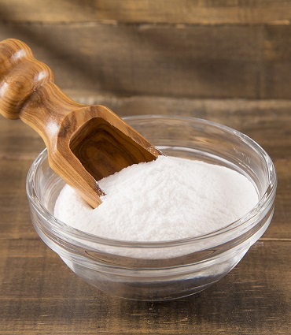
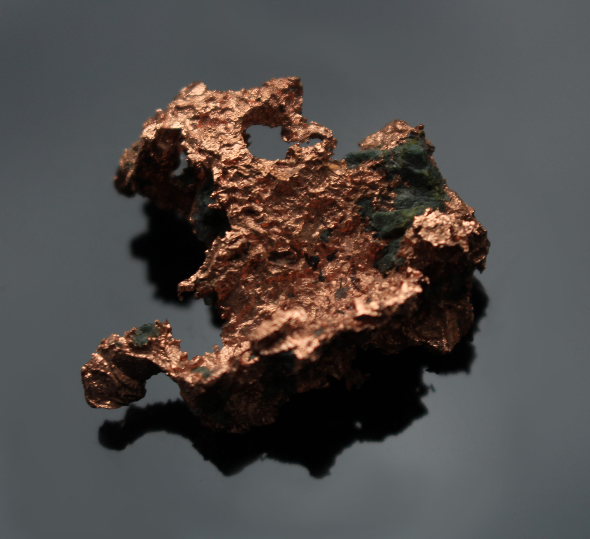

```{r setup, include=FALSE}
knitr::opts_chunk$set(echo = TRUE)
```

# Aluselised metallid

## Naatrium

### Väljanägemine



### Reageerimine

2 * Na + 2 * H~2~O -> 2 * Na(OH) + H~2~

### Kasutus

1. liha säilitamine, maitsestamine ja värvimine

2. küpsetamine

3. paksendamine

4. niiskuse säilitamine

5. maitsetugevdamine

6. toiduainete säilitamine

# Leelismuldmetallid

## Kaltsium

### Väljanägemine


### Maitse

pisut soolane ja hapukas

### Tihedus

```{r}
DENSITY_CA <- 1.55E-3 / 1E-6
DENSITY_CA
```

### Temperatuurid

```{r}
MELTING_TEMPERATURE_CA = 842 + 273.15
MELTING_TEMPERATURE_CA
BOILING_TEMPERATURE_CA = 1757.15
```

### Allotroobid

1. tahktsentreeritud kuubiline kuni 737.15 * K

2. ruumtsentreeritud kuubiline süngoonia [737.15 * K, 1115.15 * K]

### Isotoobid

stabiilsed: 40 (.97 looduses), 42, 43, 44 ja 46

pika poolestusajaga: 48

radioaktiivne kosmiline: 41 (poolestusaeg 103000 * a); tekib ka 40 neutronaktivatsioonil, umbes meetripaksuses pealmises mullakihis, seal, kus kosmiline neutronite voog on piisavalt tugev; laguneb ^41^K'ks

lühikese poolestusajaga: [34, 57] (poolestusaeg [35 * ns, 163 p]

### Looduses

Looduses vabalt ei esine, ainult komponendina: settekivimites olevate mineraalide koostises, süva- ja moondekivimites.

### Saamine

kaltsiumkloriidist elektrolüüsis:

CaCl~2~ -> Ca + Cl~2~

Supernoovas tekib C reaktsioonist mitmete α-osakestega (He tuumadega).

### Reageerimine

Õhuga moodustab oksiidi- ja nitriidikihi.

keeruline süüdata, põleb intensiivselt

Ca + 2 * H~2~O -> Ca(OH)~2~ + H~2~

happega moodustab soola

Ookeanis reageerivad lahustunud süsihappegaasiga (CO2) moodustades lubjakivi põhikomponendi – kaltsiumkarbonaadi:

Ca + 2 * HCO~3~ (CO~2~ on merevees sellisel kujul pH tõttu) → CaCO~3~ (lubjakivi) + CO~2~ + H~2~O

### Kasutus

1. divesiniku tootmiseks

2. dateerimistehnikas, kus kivimis määratakse 40K lagunemise hulk 40Ca-ks, ning arvutuste teel, teades 40K poolestusaega, selle esialgset sisaldust kivimis ja tekkinud tütarelemendi hulka, leitakse kivimi vanus

3. redutseerijana teiste metallide ekstraheerimisel

4. O, S'i või C eemaldamiseks mitmetest Fe sulamitest

5. Al'i, Be, Cu, Pb ja Mg sulamite tootmises

6. ehituses kasutatavate tsementide ja mörtide valmistamises

7. juustu tootmises, kus kaltsiumiioonid mõjutavad laabi aktiivsust, põhjustades omakorda piimavalkude kalgendumise

### Ühendid

CaO, CaCO~3~, [Ca(OH)~2~](bases.html#Kustutatud%20lubi), Ca~3~(AsO~4~)~2~, CaC~2~, CaCl~2~, Ca(C~6~H~11~O~7~)~2~, Ca(OCl)~2~, Ca(MnO~4~)~2~, Ca~3~(PO~4~)~2~, Ca~3~P~2~, Ca(C~18~H~35~O~2~)~2~, $CaSO_4 \cdot 3 \cdot H_2O$, CaWO~4~, Ca~5~(PO~4~)(OH)

# Ülemineku metallid

## Vask

### Väljanägemine



### Ioonid

1, 2

### Kasutus

1. hemoglobiini sünteesis ja raua omastamise soodustamises erütrotsüütide kujunemisel

2. kudede elastsuse tagamises, luukoe tekkes ning luude, aju, südame ja teiste organite normaalses arengus

3. stimuleerib immuunsüsteemi ja võitleb infektsioonidega, osaledes vigastuste parandamisel

5. vananemist pidurdav

6. aitab toota melaniini, mis kaitseb juukseid halliks muutumise eest

## Tsink

## Väljanägemine


## Looduses

taimedes ja loomades

### Kasutus

1. üks keskseid mineraalaineid organismi rakkude arengus, kasvus ja paljunemises
