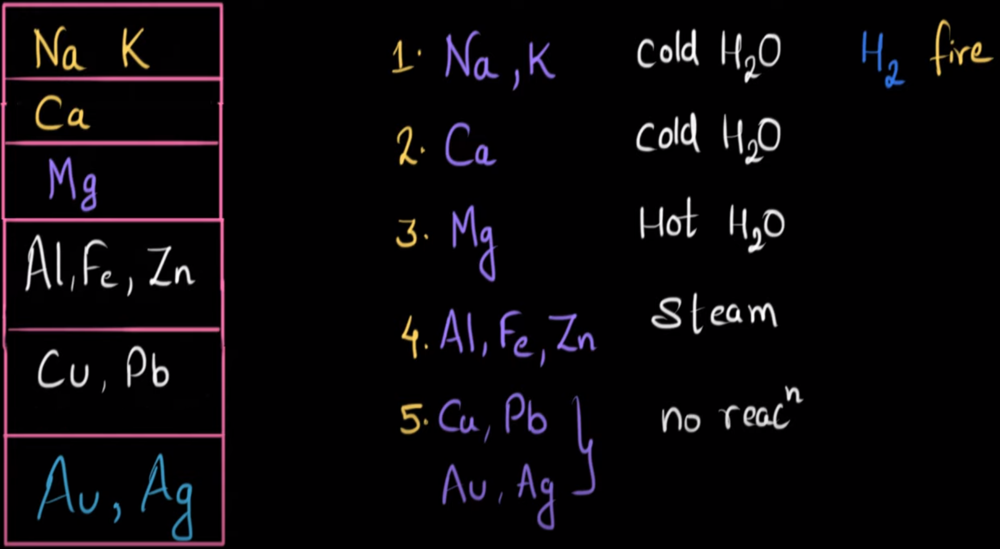
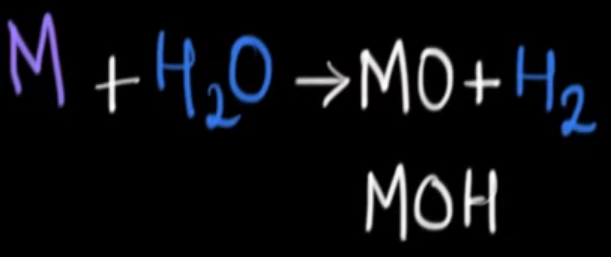
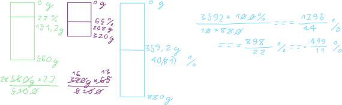
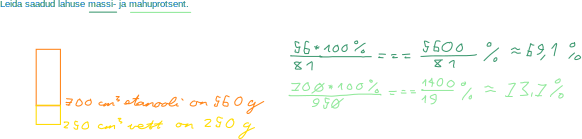
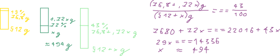
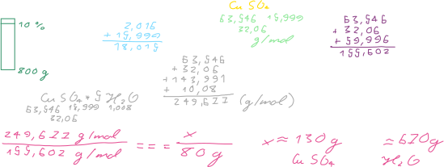
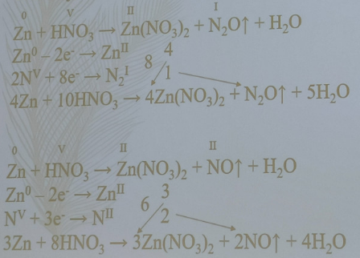
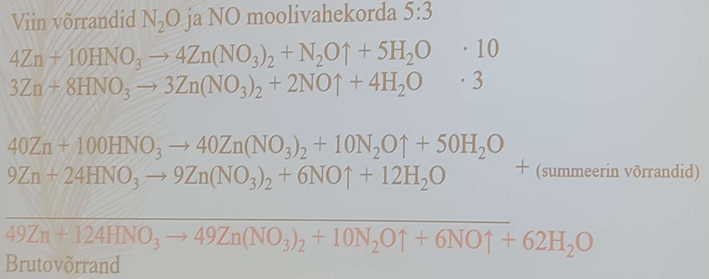

```{r setup, include=FALSE}
knitr::opts_chunk$set(echo = TRUE)
```

# Reeglid

```{r}
MOLAR_MASS_H = 1.008
MOLAR_MASS_O = 15.999
MOLAR_MASS_NA = 22.99
MOLAR_MASS_S = 32.06
MOLAR_MASS_CA = 40.078
MOLAR_MASS_CU = 63.546
MOLAR_MASS_CUSULFATE <- MOLAR_MASS_CU + MOLAR_MASS_S + MOLAR_MASS_O * 4
MOLAR_MASS_WATER <- MOLAR_MASS_H * 2 + MOLAR_MASS_O
AVOGADRO = 6.02E23
DENSITY_WATER <- .998E-3 / 1E-6
DENSITY_VAPOR_NORMAL <- 22.4e-3
DENSITY_VAPOR_STANDARD <- 22.7e-3
```

Molaarruumala gaaside puhul: normaaltingimisetel $22.4e-3 \frac{m^3}{mol}$, standardtingimustel $22.7e-3 \frac{m^3}{mol}$.





# Ülesanded

## Kaltsiumhüdroksiid

### Ülesande püstitus

Mitu % [kaltsiumi](metals.html#Kaltsium) sisaldab [kaltsiumhüdroksiid](bases.html#Kustutatud%20lubi)?

### Lahendus

Kaltsiumhüdroksiid on Ca(OH)~2~. Osamäära arvutamiseks on vaja välja arvutada kaltsiumhüdroksiidi molaarmass:

```{r}
molarMassOfCalciumHydroxide <- MOLAR_MASS_CA + 2 * (MOLAR_MASS_O + MOLAR_MASS_H)
```

Siinkohal ongi võimalik välja arvutada kaltsiumi sisalduse osamäär:

```{r}
percentageCalcium <- MOLAR_MASS_CA / molarMassOfCalciumHydroxide * 100
```


`r format(percentageCalcium, digits=5)` * % kaltsiumi sisaldab kaltsiumhüdroksiid.

## Vaskvitriol

### Ülesande püstitus

Mitu % [vaske](metals.html#Vask) sisaldab [vaskvitriol](salts.html#Vaskvitriol) (CuSO~4~ ·5H~2~O)?

### Lahendus

Arvutuskäik:

```{r}
percentageOfCu = MOLAR_MASS_CU / (MOLAR_MASS_CU + MOLAR_MASS_S + MOLAR_MASS_O * 4 + 5 * (MOLAR_MASS_H * 2 + MOLAR_MASS_O)) * 100
```


`r format(percentageOfCu, digits = 5)` * % sisaldab vaskvitriol vaske.

**5 punkti**

## Glaubrisool

### Ülesande püstitus

Mitu mooli [naatriumioone](metals.html#Naatrium) sisaldub 78 grammis [glaubrisoolas](salts.html#Glaubrisool) (Na~2~SO~4~ · 10H~2~O)?

### Lahendus

Arvutuskäik:

```{r}
numberOfMolesInMirabilite <- 78 / (MOLAR_MASS_NA * 2 + MOLAR_MASS_S + MOLAR_MASS_O * 4 + 10 * (MOLAR_MASS_H * 2 + MOLAR_MASS_O))
numberOfMolesInNa <- numberOfMolesInMirabilite * 2
```


`r format(numberOfMolesInNa, digits = 2)` mooli naatriumioone sisaldub 78 * g glaubrisoolas.

## Gaasisegu

### Ülesande püstitus

Kui suur on [hapniku](nonmetals.html#Hapnik) aatomite hulk järgmises gaasisegus:

4,5 mol N~2~O + 0,5 mol N~2~O~3~ + 1,0 mol O~2~

### Lahendus

Arvutuskäik:

```{r}
numberOfAtoms <- (4.5 * 1 + .5 * 3 + 1 * 2) * AVOGADRO
```

`r numberOfAtoms` hapniku aatomit on selles gaasisegus. See pole siiski hapniku aatomite hulk selles gaasisegus, sest hulk tähendab moolide arvu ja see on sulgudes olev 8.


## Vesi

### Ülesande püstitus

Keeduklaasis on 8 mooli [vett](water.html) arvutage selle veehulga mass (g), ruumala (dm^3^), molekulide arv, selle veekoguse aurustumisel tekkiva veeauru ruumala normaaltingimustel (dm^3^) ja standard-tingimustel.

### Lahendus

```{r}
number_moles <- 8
```

Lasen arvutada veehulga massi:

```{r}
mass_water <- number_moles * (MOLAR_MASS_H * 2 + MOLAR_MASS_O)
```

Selle veehulga mass on `r mass_water` * g.

Lasen arvutada veehulga ruumala:

```{r}
volume_water <- mass_water * 1e-3 / DENSITY_WATER * 1e3
```

Selle veehulga ruumala on `r volume_water` * dm^3^.

Lasen arvutada veehulga molekulide arvu:

```{r}
number_molecules <- number_moles * AVOGADRO
```

Selle veehulga molekulide arv on `r number_molecules`.

Lasen arvutada veehulga veeauru ruumalad:

```{r}
volume_vapor_normal <- number_moles * DENSITY_VAPOR_NORMAL * 1E3
volume_vapor_standard <- number_moles * DENSITY_VAPOR_STANDARD
```

Selle veekoguse aurustumisel tekkiva veeauru ruumala normaaltingimustel on `r volume_vapor_normal` * dm^3^ ja standardtingimustel `r volume_vapor_standard` * m^3^.


## Lahus segatavate lahuste kanguste ja masside järgi

### Ülesande püstitus

Segati 560 g 27 %-list ja  320 g 65 %-list lahust. Mitme protsendiline lahus saadi?

### Lahendus

Esimeses lahuses on 151.2 * g põhiainet. Teises lahuses on 208 * g põhiainet. Koondlahuses on seega 359.2 * g põhiainet ja koondlahus massib seega 880 * g. Saadi $\frac{3592}{8800} \cdot 100 \cdot \% === \frac{3592}{88} \cdot \% === \frac{1796}{44} \cdot \% === \frac{898}{22} \cdot \% === \frac{449}{11} \cdot \%$ lahus.



## Soolvesi

### Ülesande püstitus

Mitu grammi soola on vaja lisada 360 cm^3^ veele, et saada  15 %-line lahus?

### Lahendus

360 * cm^3^ vett on 85 * %.

Arvutuskäik:

```{r}
mass_salt = 15 / 85 * 360e-6 * DENSITY_WATER * 1e3
```

`r format(mass_salt, digits = 3)` * g soola on vaja lisada 360 * cm^3^ veele, et saada 15 * % lahus.


**10 punkti**

## Etanool

### Ülesande püstitus

Segati 700 cm^3^ veevaba etanooli (tihedus 0,8 g/cm^3^) ja 250 cm^3^ vett. Leida saadud lahuse massi- ja mahuprotsent.

### Lahendus

Arvutamine:

```{r}
volume_ethanol <- 700e-6
volume_water <- 250e-6
mass_ethanol <- volume_ethanol * .8e-3 / 1e-6
mass_water <- volume_water * DENSITY_WATER
mass_percentage <- mass_ethanol / (mass_ethanol + mass_water) * 100
volume_percentage <- volume_ethanol / (volume_ethanol + volume_water) * 100
```

`r format(mass_percentage, digits = 2)` on saadud lahuse massiprotsent ja `r format(volume_percentage, digits = 2)` on saadud lahuse mahuprotsent.



## Lahus kanguste ja olemasoleva lahuse massi järgi

### Ülesande püstitus

Laboris on 512 g 15 %-list lahust. Kui palju on vaja võtta 72 %-list lahust, et sellest valmistada 43 %-line lahus?

### Lahendus

Põhiainet 512 * g lahuses on 76.8 * g. 72 * % lahuse koguse tähistan *x*'ga. Seega on 72 * % lahuses põhiainet .72 * x * g. 43 * % lahust on (512 + x) * g. Põhiainet on selles .43 * (512 + x) * g. Siinkohal saan koostada võrrandi:

$$76.8 \cdot g + .72 \cdot x \cdot g === .43 \cdot (512 + x) \cdot g$$

Lahendan selle võrrandi:

$$76.8 \cdot g + .72 \cdot x \cdot g === 220.16 \cdot g + .43 \cdot x \cdot g$$

$$.29 \cdot x \cdot g === 153.36 \cdot g$$

$$x = \frac{15336 \cdot 100}{100 \cdot 29}$$

```{r}
library(Ryacas)
mass_solution_0 <- 512
equality <- paste(15 / 100 * mass_solution_0, "+ 72 / 100 * massSolution1 ==", 43 / 100, "* (", mass_solution_0, "+ massSolution1)")
equality
mass_solution_1 = eval(parse(text = yac_str(y_rmvars(paste("Solve(", equality, ", massSolution1)", sep ="")))))
```



Ligikaudu `r format(mass_solution_1, digits = 3)` * g on vaja võtta 72 * % lahust, et sellest valmistada 43 * % lahus.

## Vasksulfaat

### Ülesande püstitus

Mitu grammi vett ja vaskvitrioli on vaja võtta, et valmistada 800 g 10%-list CuSO~4~ lahust?

### Lahendus

Vaskvitriol koosneb vasksulfaadist ja veest. Vasksulfaadi lahuses peab olema 80 * g vasksulfaati. Lasen arvutada vasksulfaadi molaarkoguse:

```{r}
mass_solution <- 800
mass_cusulfate <- mass_solution * 10 / 100
amount_cusulfate <- mass_cusulfate / MOLAR_MASS_CUSULFATE
```

Vaskvitriolis on vasksulfaadi ja vee suhe üks viiele. Seega on vee molaarkogus viis korda suurem lõpplahuses:

```{r}
amount_water_cuvitriol <- amount_cusulfate * 5
```

Lasen arvutada lõpplahuse vaskvitrioli vee massi:

```{r}
mass_water_cuvitriol <- MOLAR_MASS_WATER * amount_water_cuvitriol
```

Lasen arvutada lõpplahuse vaskvitrioli ja vee massid:

```{r}
mass_cuvitriol <- mass_cusulfate + mass_water_cuvitriol
mass_water <- mass_solution - mass_cuvitriol
```



`r format(mass_cuvitriol, digits = 1)` * g vaskvitrioli ja `r format(mass_water, digits = 1)` * g vett on vaja võtta, et valmistada 800 * g 10 * % CuSO~4~ lahust.

**20 punkti**

## Soolalahus

### Ülesande püstitus

Laboris on 250 grammi vett ja 45 grammi 67 %-list soola vesilahust. Kui palju saab sellest valmistada 25 %-list lahust?

### Lahendus

45 grammis 67 * % soola vesilahuses on soola 30.15 * g. Lahuses, mille kangus on 25 * %, peab soola seega olema 30.15 * g. Vett peab selles 25 * % lahuses olema seega 90.45 * g. Valmistada saab .1206 * kg lahust, mille kangus on 25 * %.

## Lahus kanguste ja sihtlahuse massi järgi

### Ülesande püstitus

Laboris on 27 %-line lahus. Vaja on valmistada 460 g 45 %-list lahust.  Mitu grammi tuleb selleks võtta 73 %-list lahust?

### Lahendus

Sihtlahuses on põhiainet 207 * g. Tähistan 73 * % lahuse koguse grammides *x*'ga. Sellises juhus on 73 * % lahuses põhiainet *(.73 \* x)* * g. Lahust, mille kangus on 27 * %, on seega *(460 - x)* * g ja selles lahuses on põhiainet *.27 \* (460 - x)* * g. Koostan võrrandi:

$$.27 \cdot (460 - x) \cdot g + .73 \cdot x \cdot g === 207 \cdot g$$

Lahendan selle võrrandi:

$$124.2 - .27 \cdot x + .73 \cdot x === 207$$

$$.46 \cdot x === 82.8$$

$$x = \frac{828 \cdot 100}{10 \cdot 46} === \frac{414 \cdot 10}{23} === \frac{4140}{23} === 180$$

`r .18` * kg tuleb võtta 73 * % lahust.

## Tsink

### Ülesande püstitus

[Tsingi](metals.html#Tsink) reageerimisel [lämmastikhappega](acids.html#Lämmastikhape) tekivad [tsinknitraat](salts.html#Tsinknitraat), [vesi](water.html) ja gaasid [dilämmastikoksiid](gases.html#Naerugaas) ning [lämmastikoksiid](gases.html#Lämmastikoksiid) moolivahekorras 5:3. Koosta ja tasakaalusta reaktsiooni brutovõrrand.

### Lahendus

4 * Zn + 10 * HNO~3~ -> 4 * Zn(NO~3~)~2~ + 5 * H~2~O + N~2~O
Zn^0^ - 2 * e -> Zn^2^
2 * N^5^ + 8 * e -> N~2~^1^

3 * Zn + 8 * HNO~3~ -> 3 * Zn(NO~3~)~2~ + 4 * H~2~O + 2 * NO
Zn^0^ - 2 * e -> Zn^2^
N^5^ + 3 * e -> N^2^



Esimene võrrand tuleb korrutada kümnega, et lämmastikoksiidi ja dilämmastikoksiidi vahekord oleks vastav ülesande püstitusele:

40 * Zn + 100 * HNO~3~ -> 40 * Zn(NO~3~)~2~ + 50 * H~2~O + 10 * N~2~O

Teine võrrand tuleb samal põhjusel korrutada kolmega:

9 * Zn + 24 * HNO~3~ -> 9 * Zn(NO~3~)~2~ + 12 * H~2~O + 6 * NO

Järgnevalt tuleb võrrandid summeerida:

49 * Zn + 124 * HNO~3~ -> 49 * Zn(NO~3~)~2~ + 62 * H~2~O + 10 * N~2~O + 6 * NO



## Hapete valemid

### Ülesande püstitus

Kirjutada valemid:

väävelhape, süsihape, vesiniksulfiidhape

### Lahendus

H~2~SO~4, H~2~CO~3~, H~2~S

## Leeliste valemid

### Ülesande püstitus

Kirjutada valemid:

naatriumhüdroksiid, ammoniaakhüdraat, vask(II)hüdroksiid, baariumhüdroksiid

### Lahendus

NaOH, NH~3~•H~2~O (nuuskpiiritus), Cu(OH)~2~, Ba(OH)~2~

## Soolade valemid

### Ülesande püstitus

Kirjutada valemid:

kaaliumsulfit, kaltsiumfosfaat, naatriumnitraat, vask(II)karbonaat

### Lahendus

K~2~SO~3~, Ca~3~(PO~4~)~2~, NaNO~3~, CuCO~3~

## Oksiidide valemid

### Ülesande püstitus

Kirjutada valemid:

alumiiniumoksiid, hõbeoksiid, raud(III)oksiid

### Lahendus

Al~2~O~3~, Ag~2~O, Fe~2~^3^O~3~

## Reaktsioonivõrrandid

### Ülesande püstitus

Lõpetada reaktsioonivõrrandid ja kirjutada saaduste nimetused:

KOH + H~2~SO~4~ ->

Ca(OH)~2~ + H~3~PO~4~

### Lahendus

2 * KOH + H~2~SO~4~ -> K~2~SO~4~ + 2 * H~2~O

3 * Ca(OH)~2~ + 2 * H~3~PO~4~ -> Ca~3~(PO~4~)~2~ + 6 * H~2~O

## Lämmastik lämmastikhappes

### Ülesande püstitus

Mitu % lämmastikku sisaldub lämmastikhappes? Aatommassid: H-1, N-14, O-16.

### Lahendus

$$\frac{1400}{63} \cdot \%$$
## Kaaliumkloriidi lahus

### Ülesande püstitus

Laborandil on vaja valmistada 25 grammi 15 %-st kaaliumkloriidi lahust. Mitu grammi on vajalik võtta selleks nimetatud soola ja vett?

### Lahendus

3.75 * g nimetatud soola ja 21.25 * g vett on vajalik võtta.

## Hapniku ruumala

### Ülesande püstitus

Leidke 6 mooli hapniku ruumala standardtingimustel. Aatommass: O-16.

### Lahendus

.1362 * m^3^ on 6 mooli hapniku ruumala standardtingimustel.

## Kaltsiumkloriid

### Ülesande püstitus

Mitu mooli kaltsiumi on 12 grammis kaltsiumkloriidis? Aatommassid: Ca-40, Cl-35,5.

### Lahendus

$\frac{12}{111}$ mooli kaltsiumi on 12 * g kaltsiumkloriidis.

## Magneesium

### Ülesande püstitus

5 grammi magneesiumi reageerimisel sool- ehk vesinikkloriidhappega tekib sool ja eraldub gaasiline lihtaine. Kui suur on eralduva gaasi ruumala (dm^3^) standardtingimustel? Aatommass: Mg-24.

### Lahendus

Reaktsioonivõrrand:

Mg + 2 * HCl -> MgCl~2~ + H~2~

22.7 * dm^3^ on eralduva gaasi ruumala standardtingimustel.

## Reaktsioonivõrrandid

### Hapnik ja metall

Metal oxides are formed, which are generally basic in nature.

#### Hapnik ja aluseline metall

1. 2 * Li + O~2~ -> Li~2~O

2. 4 * Na + O~2~ -> 2 * Na~2~O

3. 4 * K + O~2~ -> 2 * K~2~O

4. 2 * Ca + O~2~ -> 2 * CaO

#### Hapnik ja mittealuseline metall

1. 2 * Mg + O~2~ -> 2 * MgO

Reaktsioon toimub kõrge temperatuuriga.

2. 4 * Al + 3 * O~2~ -> 2 * Al~2~O~3~

Reaktsioon toimub kõrge temperatuuriga.

3. 2 * Zn + O~2~ -> 2 * ZnO

Reaktsioon toimub kõrge temperatuuriga.

### Aluseline oksiid ja vesi

1. Li~2~O + H~2~O -> 2 * LiOH

2. Na~2~O + H~2~O -> 2 * NaOH

3. MgO + H~2~O -> Mg(OH)~2~

Reaktsioon toimub osaliselt.

4. K~2~O + H~2~O -> 2 * KOH

5. CaO + H~2~O -> Ca(OH)~2~

### Vesi ja ülemineku järgse metalli oksiid

1. Al~2~O~3~ + H~2~O

Ei reageeri. Kui alumiiniumpakend on auruga piiratud söögi ümber, siis ei teki alust, mis võiks söögiga seguneda.

### Vesi ja metalloid

1. H~2~O + SiO~2~

Reaktsioon ei toimu, sest kovalentne side räni ja hapniku vahel on liiga tugev.

### Vesi ja ülemineku metalli oksiid

1. FeO + H~2~O

Ei reageeri.

2. ZnO + H~2~O

Ei reageeri.

### Vesi ja metall

Metal hydroxides are formed:

1. 2 * K + 2 * H~2~O -> K~2~O + H~2~O + H~2~ -> 2 * KOH + H~2~

Selle reaktsiooni kestel eraldub soojus, mis põletab vesiniku ära.

2. $2 \cdot Na + 2 \cdot H_2^IO^{-II} \rightarrow Na_2^{I}O^{-II} + H_2^IO^{-II} + H_2 -> 2 \cdot Na^IO^{-II}H^I + H_2$

Selles reaktsioonis eraldub soojus, mis põletab vesiniku ära.

Na loovutab kaks elektroni olles redutseerija ja oksüdeerub.

3. Ca + 2 * H~2~O -> CaO + H~2~O + H~2~ -> Ca(OH)~2~ + H~2~

Selle reaktsiooni kestel eraldub sooja, mis siiski ei põleta vesinikku ära.

4. 2 * Li + 2 * H~2~O -> Li~2~O + H~2~O + H~2~ -> 2 * LiOH + H~2~

5. Mg + 2 * H~2~O -> MgO + H~2~O + H~2~ -> Mg(OH)~2~ + H~2~

See reaktsioon toimub kõrge temperatuuriga.

6. 2 * Al + 3* H~2~O -> Al~2~O~3~ + 3 * H~2~

Reaktsioon toimub kõrge temperatuuriga. Kui alumiiniumpakend on auruga piiratud söögi ümber, siis ei teki alust, mis võiks söögiga seguneda.

7. Zn + H~2~O -> ZnO + H~2~

Reaktsioon toimub kõrge temperatuuriga.

8. 3 * Fe + 4 * H~2~O <-> Fe~3~O~4~ + 4 * H~2~

9. Cu + H~2~O

reaktsioon ei toimu, sest vask on selleks liiga nõrk

10. Pb + H~2~O

Reaktsioon ei toimu.

11. Ag + H~2~O

Reaktsioon ei toimu.

12. Au + H~2~O

Reaktsioon ei toimu.

### Mittemetall ja metall

1. K + 2 * S -> K~2~S

### Vesinik ja metall

Reactive metals from ionic metal hydrides:

1. H~2~ + Li -> 2 * LiH

2. H~2~+ 2 * Na -> 2 * NaH

3. H~2~ + Ca -> CaH~2~

### Vesinik ja mittemetall

Covalent hydrides are formed:

1. H~2~ + Cl~2~ -> 2 * HCl

2. N~2~ + 3 * H~2~ -> 2 * NH~3~ (ammoniaak)

2. H~2~ + S -> H~2~S

### Vesi ja mittemetall

Generally, do not react:

1. C + H~2~O -> (CO + H~2~) (vesigaas)

See reaktsioon toimub auruga.

2. H~2~O + S

See reaktsioon ei toimu.

### Hapnik ja mittemetall

Non – metal oxides are formed, which are generally acidic in nature:

1. 2 * C + O~2~ -> 2 * CO

See reaktsioon toimub vähese hapnikuga.

2. C + O~2~ -> CO~2~

See reaktsioon toimub rohke hapnikuga.

2. 4 * P + 5 * O~2~ -> P~4~O~10~

3. $S + O_2 \rightarrow S^{IV}O_2^{-II}$

Hapnik võtab kaks elektroni olles oksüdeerija ja redutseerub. Väävel loovutab neli elektroni olles redutseerija ja oksüdeerub.

4. 2 * S + 3* O~2~ (erinev *3*'st) -> 2 * SO~3~

### Hapnik ja vesinik

1. 2 * H~2~ + O~2~ <-> 2 * H~2~O

### Halogeen ja metall

Metal chalogenides are formed which are ionic in nature:

1. 2 * Na + Cl~2~ -> 2 * NaCl

2. 2 * K + Br~2~ -> 2 * KBr

3. Ca + Cl~2~ -> CaCl~2~

4. Ba + F~2~ -> BaF~2~

### Leeliselised oksiidid

1. Li~2~O + CaO

Reaktsioon ei toimu.

### Happeline oksiid ja vesi

1. H~2~O + CO~2~ <-> H~2~CO~3~

Kui lisada süsihappe gaasi vette, siis tuleb see anum sättida suure rõhu alla, sest kui sellest me vabastame, laguneb süsihape. Karastusjoogid.

2. H~2~O + SO~2~ -> H~2~SO~3~

3. SO~3~ + H~2~O -> H~2~SO~4~

4. 6 * H~2~O + P~4~O~10~ -> 4 * H~3~PO~4~

### Happeline oksiid ja leelis

1. Ca(OH)~2~ + CO~2~ → CaCO~3~ + H~2~O

### Happeline oksiid ja hapnik

1. 2 * SO~2~ + O~2~ -> 2 * SO~3~

### Happeline oksiid ja leeliseline oksiid

1. CO~2~ + CaO → CaCO~3~

### Hape ja metall

Metals more reactive than hydrogen displace hydrogen from dilute acids to form metal salts and hydrogen gas:

1. 2 * HCl + 2 * Na -> 2 * NaCl + H~2~

2. $Zn + 2 \cdot HCl → ZnCl_2 + H_2$

3. H~2~SO~4 + 2 * K -> K~2~SO~4~ + H~2~

4. 2 * H~2~SO~4~ + Cu -> CuSO~4~ + 2 * H~2~O + SO~2~

$2 \cdot Al + 6 \cdot (konts. H_2^IS^{VI}O_4^{-II}) \xrightarrow{t°} 1 \cdot Al_2^{III}(S^{VI}O_4^{-II})_3 + 3 \cdot S^{IV}O_2^{-II} + 6 \cdot H_2^IO^{-II}$

$$Al + 3 \cdot e \rightarrow Al_2^{III}$$

$$S^{VI} - 2 \cdot e \rightarrow S^{IV}$$

Et saada võrdne arv elektronide liitmisi ja lahutamisi, on vaja alumiiniumile liidetavate elektronide arv korrutada kahega ja väävlilt eemaldatavate elektronide arv korrutada kolmega. See kaks rakendub alumiiniumi puhul kahele molekulile, kuna neid on kaks. Ühele järelikult üks.

5. $Cu + 2 \cdot (konts. H_2^IS^{VI}O_4^{-II}) \xrightarrow{t°} CuS^{VI}O_4^{-II} + S^{IV}O_2^{-II} \uparrow + 2 \cdot H_2^{I}O^{-II}$

6. $2 \cdot Al + 6 \cdot (konts. H^IN^VO_3^{-II}) \xrightarrow{t°} 1 \cdot Al_2^{III}O_3^{-II} + 6 \cdot N^{IV}O_2^{-II} + 3 \cdot H_2^IO^{-II}$

$$Al - 3 \cdot e \xrightarrow{t°} Al^{III}$$

$$N^V + 1 \cdot e \rightarrow N^{IV}$$

When conc. HNO~3~ is added to aluminium a thin protective layer of alumina (Al~2~O~3~) is formed on its surface which prevents further action. As a result, Al becomes passive.

7. $8 \cdot (konts. H^IN^VO_3^{-II}) + 3 \cdot Cu \rightarrow 3 \cdot Cu^{II}(N^VO_3^{-II})_2 + 4 \cdot H_2^IO^{-II} + 2 \cdot N^{II}O^{-II}$

$$N^V + 3 \cdot e \rightarrow N^{II}$$

$$Cu - 2 \cdot e \rightarrow Cu^{II}$$

8. $4 \cdot (konts. H^IN^VO_3^{-II}) +  \cdot Cu \rightarrow  \cdot Cu^{II}(N^VO_3^{-II})_2 +  2 \cdot H_2^IO^{-II} + 2 \cdot N^{IV}O_2^{-II}$

$$N^V + 1 \cdot e \rightarrow N^{IV}$$

$$Cu - 2 \cdot e \rightarrow Cu^{II}$$

9. HCl + Cu 

Reaktsioon ei toimu, sest vesinik on tugevam ja vask ei tõrju vesinikku välja.

10. $Al + (konts. H^IN^VO_3^{-II}, \text{suitsev pruunikalt, ebastabiilne})$

Toatemperatuuril reaktsioon ei toimu.

11. Fe + konts. H~2~SO~4~ →

Toatemperatuuril reaktsioon ei tiomu.

12. $Cu + HNO_3$

Reaktsioon ei toimu, kuna vask on nõrgem kui vesinik.

13. H~3~PO~4~ + Ag

Reaktsioon ei toimu, kuna hõbe on vesinikust nõrgem.

### Hape ja leelis

1. KOH + HCl -> KCl + H~2~O

2. $Na^IO^{-II}H^I + H^ICl^{-I} -> Na^ICl^{-I} + H_2^IO^{-II}$

3. 3 * NaOH + H~3~PO~4~ -> Na~3~PO~4~ + 3 * H~2~O

### Hape ja hapnik

1. H~2~SO~3~ + O~2~ -> H~2~SO~4~

### Hape ja leeliseline oksiid

1. 2 * HCl + CaO -> H~2~O + CaCl~2~

2. BaO + H~2~SO~4~ -> BaSO~4~ + H~2~O

### Happed

1. H~2~S + H~2~CO~3

Reaktsioon ei toimu.

### Happelised oksiidid

1. CO~2~ + SO~3~

Reaktsioon ei toimu.

### Happeline oksiid ja leelis

1. SO~2~ + Ca(OH)~2~ -> CaSO~3~ + H~2~O

### Happeline ja leeliseline oksiid

1. CaO (lubjakivi) + CO~2~ <-> CaCO~3~

2. CaO + SO~2~ -> CaSO~3~

### Sool ja metall

More reactive metal displaces less reactive metal from its salt solution:

1. $Zn + Cu^{II}S^{VI}O_4^{-II} \rightarrow Zn^{II}S^{VI}O_4^{-II} + Cu$

Zn loovutab kaks elektroni olles redutseerija ja oksüdeerub. Cu haarab kaks elektroni olles oksüdeeruja ja redutseerub.

### Sool ja mittemetall

Non-metal that is more reactive displaces less reactive non-metal from its salt solution:

1. Cl~2~ + 2 * NaBr -> 2 * NaCl + Br~2~

### Sool ja leelis

1. $CuCl_2 + 2 \cdot NaOH → 2 \cdot NaCl + Cu(OH)_2 \downarrow$ 

1. 2 * KOH + Cu(NO~3~)~2~ -> Cu(OH)~2~ + 2 * KNO~3~

2. 2 * NaOH + CuSO~4~ -> Na~2~SO~4 + Cu(OH)~2~ (sade)

3. Ca(OH)~2~ + K~2~SO~4 -> 

3. NaOH + BaCl~2~

Reaktsioon ei toimu, kuna sadet ei teki.

### Sool ja leeliseline oksiid

1. CaO + NaCl

Reaktsioon ei toimu.

### Sool ja happeline oksiid

1. CO~2~ + Fe~2~SO~4~

Reaktsioon ei toimu.

### Sool ja hape

1. Na~2~S + 2 * HCl -> 2 * NaCl + H~2~S

2. Na~2~CO~3~ + H~2~SO~4~ -> Na~2~SO~4 + H~2~CO~3~ -> Na~2~SO~4~ + H~2~O + CO~2~

3. CaCl~2~ + H~2~SO~4~ -> CaSO~4~ (mingil määral sadestub) + 2 * HCl 

4. $FeS + H_2SO_4 → H_2S \uparrow + FeSO_4$

5. CaS + H~2~SO~3~ -> H~2~S + CaSO~3~

### Soolad

1. $BaCl_2 + CuSO_4 → BaSO_4 \downarrow + CuCl_2$

2. FeCl~2~ + K~2~CO~3~ -> FeCO~3~ (sade) + 2 * KCl

3. Li~2~S + BaCl~2~

Reaktsioon ei toimu, kuna baariumsulfiid on vähelahustuv.

4. NaCl + K~2~SO~4~

Reaktsioon ei toimu, kuna ei teki sadet.

5. CuS + Na~2~CO~3

Reaktsioon ei toimu, kuna vähemalt vasksulfiid ei lahustu vees.
