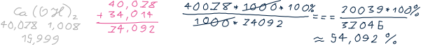
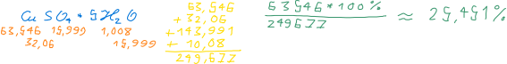
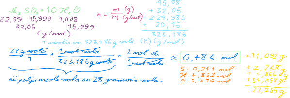
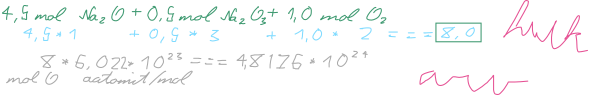
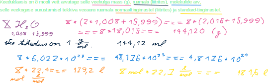

```{r setup, include=FALSE}
knitr::opts_chunk$set(echo = TRUE)
```

# Reeglid

```{r}
MOLAR_MASS_H = 1.008
MOLAR_MASS_O = 15.999
MOLAR_MASS_NA = 22.99
MOLAR_MASS_S = 32.06
MOLAR_MASS_CA = 40.078
MOLAR_MASS_CU = 63.546
AVOGADRO = 6.02E23
DENSITY_WATER <- .998E-3 / 1E-6
DENSITY_VAPOR_NORMAL <- 22.4e-3
DENSITY_VAPOR_STANDARD <- 22.7e-3
```

# Ülesanded

## Kaltsiumhüdroksiid

### Ülesande püstitus

Mitu % [kaltsiumi](metals.html#Kaltsium) sisaldab [kaltsiumhüdroksiid](bases.html#Kustutatud%20lubi)?

### Lahendus

Kaltsiumhüdroksiid on Ca(OH)~2~. Osamäära arvutamiseks on vaja välja arvutada kaltsiumhüdroksiidi molaarmass:

```{r}
molarMassOfCalciumHydroxide <- MOLAR_MASS_CA + 2 * (MOLAR_MASS_O + MOLAR_MASS_H)
```

Siinkohal ongi võimalik välja arvutada kaltsiumi sisalduse osamäär:

```{r}
percentageCalcium <- MOLAR_MASS_CA / molarMassOfCalciumHydroxide * 100
```



`r format(percentageCalcium, digits=5)` * % kaltsiumi sisaldab kaltsiumhüdroksiid.

## Vaskvitriol

### Ülesande püstitus

Mitu % [vaske](metals.html#Vask) sisaldab [vaskvitriol](salts.html#Vaskvitriol) (CuSO~4~ ·5H~2~O)?

### Lahendus

Arvutuskäik:

```{r}
percentageOfCu = MOLAR_MASS_CU / (MOLAR_MASS_CU + MOLAR_MASS_S + MOLAR_MASS_O * 4 + 5 * (MOLAR_MASS_H * 2 + MOLAR_MASS_O)) * 100
```



`r format(percentageOfCu, digits = 5)` * % sisaldab vaskvitriol vaske.

**5 punkti**

## Glaubrisool

### Ülesande püstitus

Mitu mooli [naatriumioone](metals.html#Naatrium) sisaldub 78 grammis [glaubrisoolas](salts.html#Glaubrisool) (Na~2~SO~4~ · 10H~2~O)?

### Lahendus

Arvutuskäik:

```{r}
numberOfMolesInMirabilite <- 78 / (MOLAR_MASS_NA * 2 + MOLAR_MASS_S + MOLAR_MASS_O * 4 + 10 * (MOLAR_MASS_H * 2 + MOLAR_MASS_O))
numberOfMolesInNa <- numberOfMolesInMirabilite * 2
```



`r format(numberOfMolesInNa, digits = 2)` mooli naatriumioone sisaldub 78 * g glaubrisoolas.

## Gaasisegu

### Ülesande püstitus

Kui suur on [hapniku](nonmetals.html#Hapnik) aatomite hulk järgmises gaasisegus:

4,5 mol N~2~O + 0,5 mol N~2~O~3~ + 1,0 mol O~2~

### Lahendus

Arvutuskäik:

```{r}
numberOfAtoms <- (4.5 * 1 + .5 * 3 + 1 * 2) * AVOGADRO
```

`r numberOfAtoms` hapniku aatomit on selles gaasisegus. See pole siiski hapniku aatomite hulk selles gaasisegus, sest hulk tähendab moolide arvu ja see on sulgudes olev 8.



## Vesi

### Ülesande püstitus

Keeduklaasis on 8 mooli [vett](water.html) arvutage selle veehulga mass (g), ruumala (dm^3^), molekulide arv, selle veekoguse aurustumisel tekkiva veeauru ruumala normaaltingimustel (dm^3^) ja standard-tingimustel.

### Lahendus

```{r}
number_moles <- 8
```

Lasen arvutada veehulga massi:

```{r}
mass_water <- number_moles * (MOLAR_MASS_H * 2 + MOLAR_MASS_O)
```

Selle veehulga mass on `r mass_water` * g.

Lasen arvutada veehulga ruumala:

```{r}
volume_water <- mass_water * 1e-3 / DENSITY_WATER * 1e3
```

Selle veehulga ruumala on `r volume_water` * dm^3^.

Lasen arvutada veehulga molekulide arvu:

```{r}
number_molecules <- number_moles * AVOGADRO
```

Selle veehulga molekulide arv on `r number_molecules`.

Lasen arvutada veehulga veeauru ruumalad:

```{r}
volume_vapor_normal <- number_moles * DENSITY_VAPOR_NORMAL * 1E3
volume_vapor_standard <- number_moles * DENSITY_VAPOR_STANDARD
```

Selle veekoguse aurustumisel tekkiva veeauru ruumala normaaltingimustel on `r volume_vapor_normal` * dm^3^ ja standardtingimustel `r volume_vapor_standard` * m^3^.


