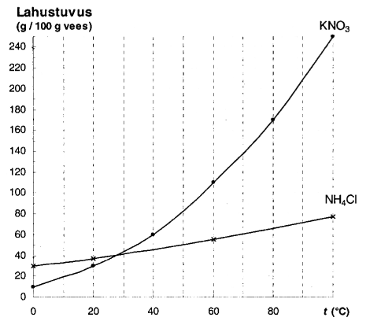

```{r setup, include=FALSE}
knitr::opts_chunk$set(echo = TRUE)
```

# Reeglid

```{r}
MOLAR_MASS_H = 1.008
MOLAR_MASS_HE <- 4.0026
MOLAR_MASS_C <- 12.011
MOLAR_MASS_N <- 14.007
MOLAR_MASS_O = 15.999
MOLAR_MASS_NA = 22.99
MOLAR_MASS_S = 32.06
MOLAR_MASS_CL <- 35.45
MOLAR_MASS_K <- 39.098
MOLAR_MASS_CA = 40.078
MOLAR_MASS_CR <- 51.996
MOLAR_MASS_FE <- 55.845
MOLAR_MASS_CU = 63.546
MOLAR_MASS_AG <- 107.87
MOLAR_MASS_AU <- 196.97
MOLAR_MASS_CUSULFATE <- MOLAR_MASS_CU + MOLAR_MASS_S + MOLAR_MASS_O * 4
MOLAR_MASS_WATER <- MOLAR_MASS_H * 2 + MOLAR_MASS_O
AVOGADRO = 6.02E23
DENSITY_WATER <- .998E-3 / 1E-6
DENSITY_VAPOR_NORMAL <- 22.4e-3
DENSITY_VAPOR_STANDARD <- 22.7e-3
```

Molaarruumala gaaside puhul: normaaltingimisetel $22.4e-3 \frac{m^3}{mol}$, standardtingimustel $22.7e-3 \frac{m^3}{mol}$.


# Ülesanded

## Kaltsiumhüdroksiid

### Ülesande püstitus

Mitu % [kaltsiumi](metals.html#Kaltsium) sisaldab [kaltsiumhüdroksiid](bases.html#Kustutatud%20lubi)?

### Lahendus

Kaltsiumhüdroksiid on Ca(OH)~2~. Osamäära arvutamiseks on vaja välja arvutada kaltsiumhüdroksiidi molaarmass:

```{r}
molarMassOfCalciumHydroxide <- MOLAR_MASS_CA + 2 * (MOLAR_MASS_O + MOLAR_MASS_H)
```

Siinkohal ongi võimalik välja arvutada kaltsiumi sisalduse osamäär:

```{r}
percentageCalcium <- MOLAR_MASS_CA / molarMassOfCalciumHydroxide * 100
```


`r format(percentageCalcium, digits=5)` * % kaltsiumi sisaldab kaltsiumhüdroksiid.

## Vaskvitriol

### Ülesande püstitus

Mitu % [vaske](metals.html#Vask) sisaldab [vaskvitriol](salts.html#Vaskvitriol) (CuSO~4~ ·5H~2~O)?

### Lahendus

Arvutuskäik:

```{r}
percentageOfCu = MOLAR_MASS_CU / (MOLAR_MASS_CU + MOLAR_MASS_S + MOLAR_MASS_O * 4 + 5 * (MOLAR_MASS_H * 2 + MOLAR_MASS_O)) * 100
```


`r format(percentageOfCu, digits = 5)` * % sisaldab vaskvitriol vaske.

**5 punkti**

## Glaubrisool

### Ülesande püstitus

Mitu mooli [naatriumioone](metals.html#Naatrium) sisaldub 78 grammis [glaubrisoolas](salts.html#Glaubrisool) (Na~2~SO~4~ · 10H~2~O)?

### Lahendus

Arvutuskäik:

```{r}
numberOfMolesInMirabilite <- 78 / (MOLAR_MASS_NA * 2 + MOLAR_MASS_S + MOLAR_MASS_O * 4 + 10 * (MOLAR_MASS_H * 2 + MOLAR_MASS_O))
numberOfMolesInNa <- numberOfMolesInMirabilite * 2
```


`r format(numberOfMolesInNa, digits = 2)` mooli naatriumioone sisaldub 78 * g glaubrisoolas.

## Gaasisegu

### Ülesande püstitus

Kui suur on [hapniku](nonmetals.html#Hapnik) aatomite hulk järgmises gaasisegus:

4,5 mol N~2~O + 0,5 mol N~2~O~3~ + 1,0 mol O~2~

### Lahendus

Arvutuskäik:

```{r}
numberOfAtoms <- (4.5 * 1 + .5 * 3 + 1 * 2) * AVOGADRO
```

`r numberOfAtoms` hapniku aatomit on selles gaasisegus. See pole siiski hapniku aatomite hulk selles gaasisegus, sest hulk tähendab moolide arvu ja see on sulgudes olev 8.


## Vesi

### Ülesande püstitus

Keeduklaasis on 8 mooli [vett](water.html) arvutage selle veehulga mass (g), ruumala (dm^3^), molekulide arv, selle veekoguse aurustumisel tekkiva veeauru ruumala normaaltingimustel (dm^3^) ja standard-tingimustel.

### Lahendus

```{r}
number_moles <- 8
```

Lasen arvutada veehulga massi:

```{r}
mass_water <- number_moles * (MOLAR_MASS_H * 2 + MOLAR_MASS_O)
```

Selle veehulga mass on `r mass_water` * g.

Lasen arvutada veehulga ruumala:

```{r}
volume_water <- mass_water * 1e-3 / DENSITY_WATER * 1e3
```

Selle veehulga ruumala on `r volume_water` * dm^3^.

Lasen arvutada veehulga molekulide arvu:

```{r}
number_molecules <- number_moles * AVOGADRO
```

Selle veehulga molekulide arv on `r number_molecules`.

Lasen arvutada veehulga veeauru ruumalad:

```{r}
volume_vapor_normal <- number_moles * DENSITY_VAPOR_NORMAL * 1E3
volume_vapor_standard <- number_moles * DENSITY_VAPOR_STANDARD
```

Selle veekoguse aurustumisel tekkiva veeauru ruumala normaaltingimustel on `r volume_vapor_normal` * dm^3^ ja standardtingimustel `r volume_vapor_standard` * m^3^.


## Lahus segatavate lahuste kanguste ja masside järgi

### Ülesande püstitus

Segati 560 g 27 %-list ja  320 g 65 %-list lahust. Mitme protsendiline lahus saadi?

### Lahendus

Esimeses lahuses on 151.2 * g põhiainet. Teises lahuses on 208 * g põhiainet. Koondlahuses on seega 359.2 * g põhiainet ja koondlahus massib seega 880 * g. Saadi $\frac{3592}{8800} \cdot 100 \cdot \% === \frac{3592}{88} \cdot \% === \frac{1796}{44} \cdot \% === \frac{898}{22} \cdot \% === \frac{449}{11} \cdot \%$ lahus.


## Soolvesi

### Ülesande püstitus

Mitu grammi soola on vaja lisada 360 cm^3^ veele, et saada  15 %-line lahus?

### Lahendus

360 * cm^3^ vett on 85 * %.

Arvutuskäik:

```{r}
mass_salt = 15 / 85 * 360e-6 * DENSITY_WATER * 1e3
```

`r format(mass_salt, digits = 3)` * g soola on vaja lisada 360 * cm^3^ veele, et saada 15 * % lahus.


**10 punkti**

## Etanool

### Ülesande püstitus

Segati 700 cm^3^ veevaba etanooli (tihedus 0,8 g/cm^3^) ja 250 cm^3^ vett. Leida saadud lahuse massi- ja mahuprotsent.

### Lahendus

Arvutamine:

```{r}
volume_ethanol <- 700e-6
volume_water <- 250e-6
mass_ethanol <- volume_ethanol * .8e-3 / 1e-6
mass_water <- volume_water * DENSITY_WATER
mass_percentage <- mass_ethanol / (mass_ethanol + mass_water) * 100
volume_percentage <- volume_ethanol / (volume_ethanol + volume_water) * 100
```

`r format(mass_percentage, digits = 2)` on saadud lahuse massiprotsent ja `r format(volume_percentage, digits = 2)` on saadud lahuse mahuprotsent.


## Lahus kanguste ja olemasoleva lahuse massi järgi

### Ülesande püstitus

Laboris on 512 g 15 %-list lahust. Kui palju on vaja võtta 72 %-list lahust, et sellest valmistada 43 %-line lahus?

### Lahendus

Põhiainet 512 * g lahuses on 76.8 * g. 72 * % lahuse koguse tähistan *x*'ga. Seega on 72 * % lahuses põhiainet .72 * x * g. 43 * % lahust on (512 + x) * g. Põhiainet on selles .43 * (512 + x) * g. Siinkohal saan koostada võrrandi:

$$76.8 \cdot g + .72 \cdot x \cdot g === .43 \cdot (512 + x) \cdot g$$

Lahendan selle võrrandi:

$$76.8 \cdot g + .72 \cdot x \cdot g === 220.16 \cdot g + .43 \cdot x \cdot g$$

$$.29 \cdot x \cdot g === 153.36 \cdot g$$

$$x = \frac{15336 \cdot 100}{100 \cdot 29}$$

```{r}
library(Ryacas)
mass_solution_0 <- 512
equality <- paste(15 / 100 * mass_solution_0, "+ 72 / 100 * massSolution1 ==", 43 / 100, "* (", mass_solution_0, "+ massSolution1)")
equality
mass_solution_1 = eval(parse(text = yac_str(y_rmvars(paste("Solve(", equality, ", massSolution1)", sep ="")))))
```


Ligikaudu `r format(mass_solution_1, digits = 3)` * g on vaja võtta 72 * % lahust, et sellest valmistada 43 * % lahus.

## Vasksulfaat

### Ülesande püstitus

Mitu grammi vett ja vaskvitrioli on vaja võtta, et valmistada 800 g 10%-list CuSO~4~ lahust?

### Lahendus

Vaskvitriol koosneb vasksulfaadist ja veest. Vasksulfaadi lahuses peab olema 80 * g vasksulfaati. Lasen arvutada vasksulfaadi molaarkoguse:

```{r}
mass_solution <- 800
mass_cusulfate <- mass_solution * 10 / 100
amount_cusulfate <- mass_cusulfate / MOLAR_MASS_CUSULFATE
```

Vaskvitriolis on vasksulfaadi ja vee suhe üks viiele. Seega on vee molaarkogus viis korda suurem lõpplahuses:

```{r}
amount_water_cuvitriol <- amount_cusulfate * 5
```

Lasen arvutada lõpplahuse vaskvitrioli vee massi:

```{r}
mass_water_cuvitriol <- MOLAR_MASS_WATER * amount_water_cuvitriol
```

Lasen arvutada lõpplahuse vaskvitrioli ja vee massid:

```{r}
mass_cuvitriol <- mass_cusulfate + mass_water_cuvitriol
mass_water <- mass_solution - mass_cuvitriol
```


`r format(mass_cuvitriol, digits = 1)` * g vaskvitrioli ja `r format(mass_water, digits = 1)` * g vett on vaja võtta, et valmistada 800 * g 10 * % CuSO~4~ lahust.

**20 punkti**

## Soolalahus

### Ülesande püstitus

Laboris on 250 grammi vett ja 45 grammi 67 %-list soola vesilahust. Kui palju saab sellest valmistada 25 %-list lahust?

### Lahendus

45 grammis 67 * % soola vesilahuses on soola 30.15 * g. Lahuses, mille kangus on 25 * %, peab soola seega olema 30.15 * g. Vett peab selles 25 * % lahuses olema seega 90.45 * g. Valmistada saab .1206 * kg lahust, mille kangus on 25 * %.

## Lahus kanguste ja sihtlahuse massi järgi

### Ülesande püstitus

Laboris on 27 %-line lahus. Vaja on valmistada 460 g 45 %-list lahust.  Mitu grammi tuleb selleks võtta 73 %-list lahust?

### Lahendus

Sihtlahuses on põhiainet 207 * g. Tähistan 73 * % lahuse koguse grammides *x*'ga. Sellises juhus on 73 * % lahuses põhiainet *(.73 \* x)* * g. Lahust, mille kangus on 27 * %, on seega *(460 - x)* * g ja selles lahuses on põhiainet *.27 \* (460 - x)* * g. Koostan võrrandi:

$$.27 \cdot (460 - x) \cdot g + .73 \cdot x \cdot g === 207 \cdot g$$

Lahendan selle võrrandi:

$$124.2 - .27 \cdot x + .73 \cdot x === 207$$

$$.46 \cdot x === 82.8$$

$$x = \frac{828 \cdot 100}{10 \cdot 46} === \frac{414 \cdot 10}{23} === \frac{4140}{23} === 180$$

`r .18` * kg tuleb võtta 73 * % lahust.

## Tsink

### Ülesande püstitus

[Tsingi](metals.html#Tsink) reageerimisel [lämmastikhappega](acids.html#Lämmastikhape) tekivad [tsinknitraat](salts.html#Tsinknitraat), [vesi](water.html) ja gaasid [dilämmastikoksiid](gases.html#Naerugaas) ning [lämmastikoksiid](gases.html#Lämmastikoksiid) moolivahekorras 5:3. Koosta ja tasakaalusta reaktsiooni brutovõrrand.

### Lahendus

4 * Zn + 10 * HNO~3~ -> 4 * Zn(NO~3~)~2~ + 5 * H~2~O + N~2~O
Zn^0^ - 2 * e -> Zn^2^
2 * N^5^ + 8 * e -> N~2~^1^

3 * Zn + 8 * HNO~3~ -> 3 * Zn(NO~3~)~2~ + 4 * H~2~O + 2 * NO
Zn^0^ - 2 * e -> Zn^2^
N^5^ + 3 * e -> N^2^


Esimene võrrand tuleb korrutada kümnega, et lämmastikoksiidi ja dilämmastikoksiidi vahekord oleks vastav ülesande püstitusele:

40 * Zn + 100 * HNO~3~ -> 40 * Zn(NO~3~)~2~ + 50 * H~2~O + 10 * N~2~O

Teine võrrand tuleb samal põhjusel korrutada kolmega:

9 * Zn + 24 * HNO~3~ -> 9 * Zn(NO~3~)~2~ + 12 * H~2~O + 6 * NO

Järgnevalt tuleb võrrandid summeerida:

49 * Zn + 124 * HNO~3~ -> 49 * Zn(NO~3~)~2~ + 62 * H~2~O + 10 * N~2~O + 6 * NO


## Leeliste valemid

### Ülesande püstitus

Kirjutada valemid:

ammoniaakhüdraat, baariumhüdroksiid

### Lahendus

NH~3~•H~2~O (nuuskpiiritus), Ba(OH)~2~

## Soolade valemid

### Ülesande püstitus

Kirjutada valemid:

kaaliumsulfit, kaltsiumfosfaat, naatriumnitraat, vask(II)karbonaat

### Lahendus

K~2~SO~3~, Ca~3~(PO~4~)~2~, NaNO~3~, CuCO~3~

## Oksiidide valemid

### Ülesande püstitus

Kirjutada valemid:

hõbeoksiid, raud(III)oksiid

### Lahendus

Ag~2~O, Fe~2~^3^O~3~

## Lämmastik lämmastikhappes

### Ülesande püstitus

Mitu % lämmastikku sisaldub lämmastikhappes? Aatommassid: H-1, N-14, O-16.

### Lahendus

$$\frac{1400}{63} \cdot \%$$
## Kaaliumkloriidi lahus

### Ülesande püstitus

Laborandil on vaja valmistada 25 grammi 15 %-st kaaliumkloriidi lahust. Mitu grammi on vajalik võtta selleks nimetatud soola ja vett?

### Lahendus

3.75 * g nimetatud soola ja 21.25 * g vett on vajalik võtta.

## Hapniku ruumala

### Ülesande püstitus

Leidke 6 mooli hapniku ruumala standardtingimustel. Aatommass: O-16.

### Lahendus

.1362 * m^3^ on 6 mooli hapniku ruumala standardtingimustel.

## Kaltsiumkloriid

### Ülesande püstitus

Mitu mooli kaltsiumi on 12 grammis kaltsiumkloriidis? Aatommassid: Ca-40, Cl-35,5.

### Lahendus

$\frac{12}{111}$ mooli kaltsiumi on 12 * g kaltsiumkloriidis.

## Magneesium

### Ülesande püstitus

5 grammi magneesiumi reageerimisel sool- ehk vesinikkloriidhappega tekib sool ja eraldub gaasiline lihtaine. Kui suur on eralduva gaasi ruumala (dm^3^) standardtingimustel? Aatommass: Mg-24.

### Lahendus

Reaktsioonivõrrand:

Mg + 2 * HCl -> MgCl~2~ + H~2~

22.7 * dm^3^ on eralduva gaasi ruumala standardtingimustel.

## Lahustuvus

### Ülesande püstitus



1. 50 g veele lisati temperatuuril 40 oC 20 g KNO3. Kas saadi (sellel temperatuuril) küllastunud või küllastumata lahus?

2. 100 g  veest ja vastavast kogusest KNO3-st valmistati temperatuuril 80 oC küllastunud lahus. Mitu grammi KNO3 sadestub, kui see lahus jahutada 20 oC-ni?

### Lahendus

1. Saadi küllastumata lahus.

2. 140 * g KNO~3~ sadestub, kui see lahus jahutada 20 * °C'ni.

## Väävelhappe molekulid

### Ülesande püstitus

Mitmes väävelhappe molekulis sisaldub 56 hapniku aatomit?

### Lahendus

14's väävelhappe molekulis sisaldub 56 hapniku aatomit.

## Väävelhappe moolid 

### Ülesande püstitus

Mitmes moolis väävelhappes on 12 mooli hapniku aatomeid?

### Lahendus

Ühes moolis väävelhappes on neli hapniku aatomit. Väävelhappe molekule, milles on 12 hapniku aatomit, on järelikult kolm.

Kolmes moolis väävelhappes on 12 * mol hapniku aatomeid.

## Kaaliumdikromaat

### Ülesande püstitus

Mitu mooli kaaliumi sisaldub 14 moolis kaaliumdikromaadis (K~2~Cr~2~O~7~)?

### Lahendus

28 * mol kaaliumi sisaldub 14 moolis kaaliumdikromaadis.

## Vase, alumiiniumi ja fosfori aatomid

### Ülesande püstitus

Mitu mooli vase, alumiiniumi ja fosfori aatomeid ning vee molekule on 2,4 moolis mineraal türkiisis [CuAl~6~(PO~4~)4(OH)~8~ ∙ 4H~2~O]?

### Lahendus

Vase aatomeid on 2.4 * mol türkiisis 2.4 * mol.

Alumiiniumi aatomeid on 2.4 * mol türkiisis 14.4 * mol.

Fosfori aatomeid on 2.4 * mol türkiisis 9.6 * mol.

Vee molekule on 2.4 * moolis türkiisis 9.6 * mol.

## Vesinik fosforhappes

### Ülesande püstitus

Mitu grammi vesinikku sisaldub 5 moolis fosforhappes?

### Lahendus

Arvutuskäik:

```{r}
mass_hydrogen <- 5 * 3 * MOLAR_MASS_H
```

`r mass_hydrogen` * g vesinikku sisaldub 5 * mol fosforhappes.

## Süsinikdioksiid

### Ülesande püstitus

Mitu hapniku aatomit on 1 moolis süsinikdioksiidis?

### Lahendus

Arvutuskäik:

```{r}
number_atoms_oxygen <- 2 * AVOGADRO
```

`r number_atoms_oxygen` hapniku aatomit on 1 * mol süsinikdioksiidis.

## Raua aatomi hulk

### Ülesande püstitus

Leida 1,806 · 10^23^ raua aatomi hulk moolides?

### Lahendus

3E-1 on 1.806 * 10^23^ raua aatomi hulk moolides.

## Kontsentreeritud lämmastikhappe reageerimine vasega

### Ülesande püstitus

Mitu dm^3^ gaasi eraldub 30 * g kontsentreeritud lämmastikhappe reageerimisel 30 * g vasega?

### Lahendus

Reaktsioonivõrrand:

$$4 \cdot (konts. H^IN^VO_3^{-II}) +  \cdot Cu \rightarrow  \cdot Cu^{II}(N^VO_3^{-II})_2 +  2 \cdot H_2^IO^{-II} + 2 \cdot N^{IV}O_2^{-II}$$

Järgnevalt on vaja arvutada, mitu mooli on koostisosi tegelikult etteantud grammmaaži põhjal.

Arvutan 30 * g kontsentreeritud lämmastikhappe moolide arvu:

```{r}
moles_concentrated_hno3 <- 30 / (MOLAR_MASS_H + MOLAR_MASS_N + MOLAR_MASS_O * 3)
```

See arvutatud moolide arv `r moles_concentrated_hno3` kehtib nelja üldise mooli kohta. Lasen arvutada ühe üldise mooli kohta:

```{r}
moles_concentrated_hno3_per_mol <- moles_concentrated_hno3 / 4
```

Ühe üldise mooli kohta on kontsentreeritud lämmastikhappe moolide arv `r moles_concentrated_hno3_per_mol`.

Lasen arvutada 30 * g vase moolide arvu:

```{r}
moles_cu <- 30 / MOLAR_MASS_CU
```

Võrdlen, kumb grammaažipõhine moolide arv on väiksem, ja väiksema põhjal lasen arvutada eralduva gaasi NO~2~ ruumala:

```{r}
if (moles_concentrated_hno3_per_mol < moles_cu) {
  volume_no2 <- moles_concentrated_hno3 / 2 * DENSITY_VAPOR_STANDARD * 1e3
} else {
  volume_no2 <- moles_cu * 2 * DENSITY_VAPOR_STANDARD * 1e3
}
```

`r signif(volume_no2, digits <- 5)` * dm^3^ gaasi eraldub 30 * g kontsentreeritud lämmastikhappe reageerimisel 30 * g vasega.

## Vees lahustatud sool ja suhkur

### Ülesande püstitus

250 g vees on lahustatud 27 g soola ja 67 g suhkrut. Leida soola ja suhkru %-line sisaldus lahuses.

### Lahendus

Lahus koosneb veest, soolast ja suhkrust. Kokku on lahuse mass 344 * g.

Soola %-line sisaldus lahuses on $\frac{27 * 100}{344} === \frac{2700}{344} === \frac{1350}{172} === \frac{675}{86} === 1\frac{589}{86} === 2\frac{503}{86} === 3\frac{417}{86} === 4\frac{331}{86} === 5\frac{245}{86} === 6\frac{159}{86} === 7\frac{73}{86}$. Suhkru %-line sisaldus lahuses on $19\frac{41}{86}$.

Lasen ka arvutada ebatäpsed väärtused:

```{r}
mass_solution <- 27 + 67 + 250
percentage_salt <- 27 / mass_solution * 100
percentage_sugar<- 67 / mass_solution * 100
```

Ebatäpselt ehk ümardatult on soola %-line sisaldus lahuses `r signif(percentage_salt, digits <- 2)` ja suhkru oma `r signif(percentage_sugar, digits <- 2)`.

## Soola lisamine soola lahusele

### Ülesande püstitus

Mitu grammi soola on vaja lisada 34 g 45%-lisele soola lahusele, et saada 60%-ne lahus?

### Lahendus

Esialgses lahuses on 15.3 * g soola.

$\frac{5.1}{.4} \cdot g === \frac{51}{4} \cdot g === 12.75 \cdot g$ soola on vaja lisada 34 * g'le 45%'lisele soola lahusele, et saada 60%'ne lahus.

## Lahuste segamine

### Ülesande püstitus

Segati 320 g 10%-list ja 80 g 20%-list lahust. Mitme protsendiline lahus saadi?

### Lahendus

12%-line lahus saadi.

## Sool veele

### Ülesande püstitus

Mitu grammi soola on vaja lisada 200 cm^3^ veele, et saada 10%-line lahus?

### Lahendus

Arvutuskäik:

```{r}
mass_water <- 200e-6 * DENSITY_WATER
mass_water
mass_salt <- mass_water * 10 / 90 * 1e3
```

`r signif(mass_salt, digits <- 1)` * g soola on vaja lisada 200 * cm^3^ veele, et saada 10%-line lahus.

## Vasksulfaadi lahus

### Ülesande püstitus

Teil on vaja valmistada 120 g 35 %-st CuSO~4~ lahust. Laboris on olemas 25 %-ne CuSO~4~ lahus. Kui palju 90 %-st CuSO~4~ lahust tuleb sinna lisada, et valmistada vajalik lahus?

### Lahendus

Kuna küsitakse, kui palju 90%-list vasksulfaadi lahust tuleb lisada, siis tähistan 90%-lise vasksulfaadi lahuse koguse grammides *x*'ga. Selles lahuses on siis vasksulfaati *.9 \* x* * g. Kuna kokku on vaja valmistada 120 * g lahust, on 25%'st lahust *(120 - x)* * g. Vasksulfaati on selles teises lahuses *.25 \* (120 - x)* * g. Kokku on lõpplahuses vasksulfaati *(.9 \* x + .25 \* (120 - x))* * g. Lõpplahuse vasksulfaadi ja 120 * g suhe on .35:

$$\frac{(.9 \cdot x + .25 \cdot (120 - x)) \cdot g}{120 \cdot g} === .35$$

Lahendan selle võrrandi:

$$.9 \cdot x + 30 - .25 \cdot x === 42$$

$$.65 \cdot x === 12$$

$$x = \frac{12 \cdot 100}{65} === \frac{12 \cdot 20}{13} === \frac{240}{13} === 18\frac{6}{13}$$

See on kogus grammides. Teisendan kilogrammideks:

$$\frac{240}{13} \cdot g \cdot \frac{.001 \cdot kg}{1 \cdot g} === \frac{240}{13000} \cdot kg === \frac{24}{1300} \cdot kg === \frac{12}{650} \cdot kg === \frac{6}{325} \cdot kg$$

Lasen selle väärtuse ka ebatäpseks arvutada:

```{r}
library(Ryacas)
equality <- "(90 / 100 * mass + 25 / 100 * (120e-3 - mass)) / 120e-3 == 35 / 100"
mass_solution_0 = eval(parse(text = yac_str(y_rmvars(paste("Solve(", equality, ", mass)", sep ="")))))
mass_solution_0
```

$\frac{6}{325} \cdot kg$ ehk ebatäpselt `r signif(mass_solution_0, digits <- 2)` * kg 90%'list CuSO~4~ lahust tuleb lisada, et valmistada vajalik lahus.

## Kaaliumditsüanoauraat

### Ülesande püstitus

Mitu % kulda sisaldab kaaliumditsüanoauraat(I) - K[Au(CN)~2~]?

### Lahendus

Arvutuskäik:

```{r}
percentage_au <- MOLAR_MASS_AU / (MOLAR_MASS_K + MOLAR_MASS_AU + (MOLAR_MASS_C + MOLAR_MASS_N) * 2) * 100
```

`r signif(percentage_au, digits <- 5)`% kulda sisaldab kaaliumditsüanoauraat(I) - K[Au(CN)~2~].

## Moolide arv gaaside segus

### Ülesande püstitus

Leia CO₂ ja SO₃ moolide arv 9,03∙10^24^ molekulis gaaside segus kui ühe CO₂ molekuli kohta tuleb kaks SO₃ molekuli.

### Lahendus

Arvutuskäik:

```{r}
number_mol <- 9.03e24 / AVOGADRO
number_molecules <- 1 + 2
number_mol_co2 <- number_mol * 1 / number_molecules
number_mol_so3 <- number_mol * 2 / number_molecules
```

`r number_mol_co2` on CO~2~ ja `r number_mol_so3` SO~3~ moolide arv 9.03e^24^ molekulis gaaside segus, kui ühe CO~2~molekuli kohta tuleb kaks SO~3~molekuli.

## Vesiniku moolide arv

### Ülesande püstitus

Mitu mooli on 5,6 m^3^ vesinikku (normaal tingimustel - nt)?

### Lahendus

Arvutuskäik:

$$\frac{5.6 \cdot m^3}{.0224 \cdot \frac{m^3}{mol}} === \frac{56 \cdot 10000}{10 \cdot 224} \cdot mol === \frac{28 \cdot 1000}{112} \cdot mol === \frac{7 \cdot 1000}{28} \cdot mol === 250 \cdot mol$$

250 mooli on 5.6 * m^3^ vesinikku nt normaaltingimustes.

## Happevihma põhjustav gaas

### Ülesande püstitus

Kui suur ruumala on 16 g happevihma põhjustaval gaasil vääveldioksiidil (nt)?

### Lahendus

Arvutuskäik:

```{r}
volume <- 16 / (MOLAR_MASS_S + MOLAR_MASS_O * 2) * DENSITY_VAPOR_STANDARD
```

`r signif(volume, digits <- 5)` * m^3^ suurune ruumala on 16 * g happevihma põhjustaval gaasil vääveldioksiidil normaaltingimustes.

## Hingamisel süsinikdioksiidi eritamine

### Ülesande püstitus

Hingamisel eritab inimene ööpäevas keskmiselt 1,0 kg süsinikdioksiidi. Leida eralduva süsihappegaasi maht.

### Lahendus

Arvutuskäik:

```{r}
volume <- 1.0e3 / (MOLAR_MASS_C + MOLAR_MASS_O * 2) * DENSITY_VAPOR_STANDARD
```

`r signif(volume, digits <-5 )` * m^3^ on eralduva süsihappegaasi maht.

## Õhupallid

### Ülesande püstitus

Üks õhupall oli täidetud 1 g vesinikuga (H~2~) ja teine 1 g heeliumiga (He). Näidata arvutustega, kumma õhupalli ruumala on normaaltingimustel suurem.

### Lahendus

Arvutuskäik:

```{r}
volume_h2 <- 1 / (MOLAR_MASS_H * 2) * DENSITY_VAPOR_NORMAL
volume_h2
volume_he <- 1 / (MOLAR_MASS_HE) * DENSITY_VAPOR_NORMAL
volume_he
if (volume_h2 > volume_he) {
  answer <- "Vesinikuga täidetud õhupalli ruumala on normaaltingimustes suurem."
} else if (volume_he > volume_h2) {
  answer <- "Heeliumiga täidetud õhupalli ruumala on normaaltingimustes suurem."
} else {
  answer <- "Õhupallide ruumalad on normaaltingimustes võrdsed."
}
```

`r answer`

## Kloor ja vääveldioksiid

### Ülesande püstitus

Kummas on rohkem molekule, kas 700 ml klooris või 34 g vääveldioksiidis?

### Lahendus

Arvutuskäik:

```{r}
number_molecules_cl <- 700e-6 / DENSITY_VAPOR_STANDARD * AVOGADRO
number_molecules_so2 <- 34 / (MOLAR_MASS_S + MOLAR_MASS_O * 2) * AVOGADRO
if (number_molecules_cl > number_molecules_so2) {
  answer <- "700 * ml klooris on rohkem molekule kui 34 * g vääveldioksiidis."
} else if (number_molecules_so2 > number_molecules_cl) {
  answer <- "34 * g vääveldioksiidis on rohkem molekule kui 700 * ml klooris."
} else {
  answer <- "700 * ml klooris ja 34 * g vääveldioksiidis on ühepalju molekule."
}
```

`r answer`

## Hapniku aatomid

### Ülesande püstitus

Mitu mooli hapniku aatomeid sisaldab: 
a) 3 mooli vett 
b) 12 mooli väävelhapet 
c) 8 mooli Al(NO~3~)~3~ 
d) 2000 g Ca(OH)~2~ 
e) 0,56 m^3^ vääveltrioksiidi.

### Lahendus

a) 3 * mol hapniku aatomeid sisaldab 3 * mol vett.

b) 48 * mol hapniku aatomeid sisaldab 12 * mol väävelhapet.

c) 72 * mol hapniku aatomeid sisaldab 8 * mol Al(NO~3~)~3~.

d) Arvutused:

```{r}
number_atoms_oxygen <- 2000 / (MOLAR_MASS_CA + (MOLAR_MASS_O + MOLAR_MASS_H) * 2) * 2
```

`r signif(number_atoms_oxygen, digits <- 5)` * mol hapniku aatomeid sisaldab 2000 * g Ca(OH)~2~.

e) Arvutused:

```{r}
number_atoms_oxygen <- .56 / DENSITY_VAPOR_STANDARD * 3
```

`r signif(number_atoms_oxygen, digits <- 3)` * mol hapniku aatomeid sisaldab .56 * m^3^ vääveltrioksiidi.

## Lämmastik sõrmkübaras

### Ülesande püstitus

Mitu lämmastiku molekuli on sõrmkübaras (3,0 cm^3^) olevas õhus, kui mahuliselt on õhus 78% lämmastikku?

### Lahendus

Arvutuskäik:

```{r}
number_molecules <- 3.0e-6 * 78 / 100 / DENSITY_VAPOR_STANDARD * AVOGADRO
```

`r signif(number_molecules, digits <- 3)` lämmastiku molekuli on sõrmkübaras olevas õhus, kui mahuliselt on õhus 78% lämmastikku.

## Vesiniku ja hapniku moolide arv gaaside segus

### Ülesande püstitus

Arvutada 33,6 m³ gaaside segus sisalduv vesiniku ja hapniku moolide arv kui neid on mahuliselt vastavalt 60% ja 40%.

### Lahendus

Arvutuskäik:

```{r}
volume <- 33.6
number_moles_h <- volume / DENSITY_VAPOR_STANDARD * 60 / 100
number_moles_o <- volume / DENSITY_VAPOR_STANDARD * 40 / 100
```

`r signif(number_moles_h, digits <- 3)` on vesiniku ja `r signif(number_moles_o, digits <- 3)` hapniku moolide arv 33.6 * m^3^ gaaside segus, kui neid on vastavalt 60% ja 40%.

## Ammoniaagivesi

### Ülesande püstitus

Mitu mooli ammoniaaki sisaldub 10 kg 6,8% ammoniaagivees?

### Lahendus

Arvutuskäik:

```{r}
number_moles <- 10e3 * 6.8 / 100 / (MOLAR_MASS_N + MOLAR_MASS_H * 3)
```

`r signif(number_moles, digits <- 5)` * mol ammonikaaki sisaldub 10 * kg 6.8%-lises ammoniaagivees.

## Ammoniaagilahus

### Ülesande püstitus

Mitu mooli NH₃ on lahustunud 1 m³ lahuses kui 7 m³ lahuse valmistamiseks kulus 78,4 m³ ammoniaaki?

### Lahendus

Arvutuskäik:

```{r}
number_moles <- 78.4 / 7 / DENSITY_VAPOR_STANDARD
```

Ligikaudu `r signif(number_moles, digits <- 3)` * mol NH~3~ on lahustunud 1 * m^3^ lahuses, kui 7 * m^3^ lahuse valmistamiseks kulus 78.4 * m^3^ ammoniaaki.

## Moolide arv väävelhappe lahuses

### Ülesande püstitus

Arvutada vee ja väävelhappe moolide arv 180 g 68%-lises väävelhappe lahuses.

### Lahendus

Arvutuskäik:

```{r}
mass <- 180
number_moles_water <- mass * (100 - 68) / 100 / (MOLAR_MASS_H * 2 + MOLAR_MASS_O)
number_moles_h2so4 <- mass * 68 / 100 / (MOLAR_MASS_H * 2 + MOLAR_MASS_S + MOLAR_MASS_O * 4)
```

`r signif(number_moles_water, digits <- 5)` on vee ja `r signif(number_moles_h2so4, digits <- 5)` väävelhappe moolide arv 180 * g 68%'lises väävelhappe lahuses.

## Hapnik lämmastikhappes

### Ülesande püstitus

Leia hapniku aatomite moolide arv 3,01∙10^22^ molekulis lämmastikhappes.

### Lahendus

Arvutuskäik:

```{r}
number_moles <- 3.01e22 / AVOGADRO * 3
```

`r number_moles` * mol hapniku aatomeid on 3.01e22's molekulis lämmastikhappes.

## Gaasisegu mass

### Ülesande püstitus

Kui suur on 9,03∙10^26^ CO₂ molekulist ja 3,01∙10^25^ molekulist lämmastikdioksiidist  koosneva gaasisegu mass?

### Lahendus

Arvutuskäik:

```{r}
mass <- (9.03e26 / AVOGADRO * (MOLAR_MASS_C + MOLAR_MASS_O * 2) + 3.01e25 / AVOGADRO * (MOLAR_MASS_N + MOLAR_MASS_O * 2)) *1e-3
```

`r mass` * kg on 9.03e26 CO~2~ molekulist ja 3.01e25 molekulist lämmastikdioksiidist koosneva gaasisegu mass.

## Vääveltrioksiidist ja süsinikdioksiidist koosneva gaasisegu mass

### Ülesande püstitus

Arvutada 5,6 m³ gaasisegu mass kui see koosneb 60 mahuprotsendist vääveltrioksiidist ja 40 mahuprotsendist süsinikdioksiidist.

### Lahendus

Arvutuskäik:

```{r}
mass <- 5.6 / 100 / DENSITY_VAPOR_STANDARD * (60 * (MOLAR_MASS_S + MOLAR_MASS_O * 3) + 40 * (MOLAR_MASS_C + MOLAR_MASS_O * 2)) * 1e-3
```

`r signif(mass, digits <- 5)` * kg on 5.6 * m^3^ gaasisegu mass, kui see koosneb 60'st mahuprotsendist vääveltrioksiidist ja 40'st mahuprotsendist süsinikdioksiidist.

## Hõbeda ja kulla sisaldus

### Ülesande püstitus

Leida hõbeda ja kulla sisaldus massiprotsentides, kui sulam koosneb 0,5 moolist Ag-st ja 0,25 moolist Au-st.

### Lahendus

Arvutuskäik:

```{r}
mass_ag <- .5 * MOLAR_MASS_AG 
mass_au <- .25 * MOLAR_MASS_AU
masses <- mass_ag + mass_au
percentage_ag <- mass_ag / masses * 100
percentage_au <- mass_au / masses * 100
```

Ligikaudu `r signif(percentage_ag, digits <- 5)` on hõbeda ja ligikaudu `r signif(percentage_au, digits <- 5)` kulla sisaldus massiprotsentides, ku isulam koosneb .5 * mol Ag'st ja .25 * mol Au'st.

## Lämmastiku aatomid segus

### Ülesande püstitus

Mitu mooli lämmastiku aatomeid on segus, mis koosneb 15 moolist lämmastikdioksiidist ja 50 g gaasilisest lämmastikust?

### Lahendus

```{r}
number_moles <- 15 + 50 / MOLAR_MASS_N
```

`r signif(number_moles, digits <- 5)` * mol lämmastiku aatomeid on segus, mis koosneb 15 * mol lämmastikdioksiidist ja 50 * g gaasilisest lämmastikust.

## Klaasitäis vedelat vett

### Ülesande püstitus

Mitu vesiniku aatomit on klaasitäies vedelas vees (klaasi ruumala on 200 ml ja ρ(H~2~O) ≈ 1 g/cm3)?

### Lahendus

Arvutuskäik:

```{r}
number_atoms <- 200e-6 * 1e-3 / 1e-6 / (MOLAR_MASS_WATER * 1e-3) * 2 * AVOGADRO
```

Ligikaudu `r signif(number_atoms, digits <- 5)` vesiniku aatomit on klaasitäies vedelas vees.

## Aspiriin

### Ülesande püstitus

Mitu süsiniku aatomit satub inimese organismi ühe tableti aspiriiniga (C~9~H~8~O~4~, tableti mass on 500 mg)?

### Lahendus

Arvutuskäik:

```{r}
number_atoms <- 500e-3 / (MOLAR_MASS_C * 9 + MOLAR_MASS_H * 8 + MOLAR_MASS_O * 4) * 9 * AVOGADRO
```

Ligikaudu `r signif(number_atoms, digits <- 5)` süsiniku aatomit satub inimese organismi ühe tableti aspiriiniga.

## Koostisega segu 

### Ülesande püstitus

Segul (nt) on järgmine koostis: 150 dm^3^ H~2~ + 30 g HNO~3~ + 3 mol H~3~PO~4~.

a) Leia segus oleva 150 dm^3^ H~2~ mass.

b) Mitu mooli vesiniku aatomeid on segus kokku? Mitu vesiniku aatomit see on? 

c) Mitu korda on segus lämmastiku aatomeid vähem kui on vesiniku aatomeid?

### Lahendus

Üldarvutused:

```{r}
number_moles_h2 <- 150e-3 / DENSITY_VAPOR_NORMAL
number_moles_n <- 30 / (MOLAR_MASS_H + MOLAR_MASS_N + MOLAR_MASS_O * 3)
```

a) Arvutuskäik:

```{r}
mass <- number_moles_h2 * (MOLAR_MASS_H * 2) * 1e-3
```

`r mass` * kg on segus oleva 150 * dm^3^ H~2~ mass.

b) Arvutuskäik:

```{r}
number_moles <- number_moles_h2 * 2 + number_moles_n + 3 * 3
number_atoms_h <- number_moles * AVOGADRO
```

Ligikaudu `r signif(number_moles, digits <- 5)` * mol vesiniku aatomeid on segus kokku. Ligikaudu `r signif(number_atoms_h, digits <- 5)` vesiniku aatomit see on.

c) Arvutuskäik:

```{r}
ratio <- number_atoms_h / number_moles_n / AVOGADRO
ratio
inversed_ratio <- 1 / ratio
```

Ligikaudu `r signif(inversed_ratio, digits <- 5)` korda on segus lämmastiku aatomeid vähem ku ion vesiniku aatomeid.

## Hapniku aatomite hulk gaasisegus

### Ülesande püstitus

Arvutage hapniku aatomite hulk (moolides) järgmises gaasisegus: 
3,5 mol N~2~O + 0,5 mol N~2~O~3~ + 1,0 mol O~2~

### Lahendus

7.0 on hapniku aatomite hulk.

## Naatriumioonid glaubrisoolas

### Ülesande püstitus

Mitu mooli naatriumioone sisaldub 48,3 g glaubrisoolas (Na~2~SO~4~ · 10H~2~O)?

### Lahendus

Arvutuskäik:

```{r}
number_moles <- 48.3 / (MOLAR_MASS_NA * 2 + MOLAR_MASS_S + MOLAR_MASS_O * 4 + 10 * (MOLAR_MASS_H * 2 + MOLAR_MASS_O)) * 2
```

`r (signif(number_moles, digits <- 5))` * mol naatriumioone sisaldub 48.3 * g glaubrisoolas.

## Süsinikoksiidi ja -dioksiidi gaasisegu

## Ülesande püstitus

Arvutada võrdsest arvust CO ja CO₂ molekulidest koosneva  448 dm³ gaasisegu mass.

### Lahendus

Arvutuskäik:

```{r}
mass <- 448e-3 / DENSITY_VAPOR_STANDARD * (MOLAR_MASS_C + MOLAR_MASS_O + MOLAR_MASS_C + MOLAR_MASS_O * 2) * 1e-3
```

Ligikaudu `r signif(mass, digits <- 5)` * kg on võrdsest arvust CO ja CO~2~ molekulidest koosneva 448 * dm^3^ gaasisegu mass.

## Hapniku aatomite arv väävelhappes 

### Ülesande püstitus

Arvuta  hapniku aatomite arv 2,5 moolis väävelhappes.

### Lahendus

6.02e24 hapniku aatomit on 2.5 * mol väävelhappes.

## Vesiniku aatomite arv ammoniaagis

### Ülesande püstitus

Arvutada vesiniku aatomite arv, mis sisaldub 0,112 cm³ ammoniaagis.

### Lahendus

Arvutuskäik:

```{r}
number_atoms <- .112e-6 / DENSITY_VAPOR_STANDARD * 3 * AVOGADRO
```

Ligikaudu `r signif(number_atoms, digits <- 3)` vesiniku aatomit sisaldub .112 * cm^3^ ammoniaagis.

## Trihapniku ruumala

### Ülesande püstitus

Milline on 18,06∙10^27^ hapniku aatomist koosneva trihapniku (osooni O₃) ruumala?

### Lahendus

Hapniku moole on 3e4. Osooni moole on 1e4.

227 * m^3^ on 18.06e27'st hapniku aatomist koosneva trihapniku ruumala.

## Gaasisegu ruumala

### Ülesande püstitus

Gaasisegu koostises on 400 g SO₃ ja 88 g CO₂. Leia selle gaasisegu ruumala.

### Lahendus

Arvutuskäik:

```{r}
volume <- (400 / (MOLAR_MASS_S + MOLAR_MASS_O * 3) + 88 / (MOLAR_MASS_C + MOLAR_MASS_O * 2)) * DENSITY_VAPOR_STANDARD
```

Ligikaudu `r signif(volume, digits <- 5)` * m^3^ on gaasisegu ruumala.

## Lämmastik gaaside segus

### Ülesande püstitus

Millise ruumala võtab enda alla 9,03∙10^26^ molekulist koosnevas gaaside segus lämmastiku kui tema sisaldus mahu järgi on 10%?

### Lahendus

Arvutuskäik:

```{r}
volume <- 9.03e26 / AVOGADRO * DENSITY_VAPOR_STANDARD * 10 / 100
```

`r volume` * m^3 võtab enda alla 9.03e26'st molekulist koosnevas gaaside segus lämmastik, kui selle sisaldus mahu järgi on 10%.

## Massiprotsentides

### Ülesande püstitus

Gaaside segu koosneb mahuliselt 30% SO₂ ja 70% lämmastikust. Leia koostis massiprotsentides.

### Lahendus

Lämmastik ja SO~2~ suhtuvad mahuliselt üksteisesse kui 7 : 3. See on ka molaarselt nii. Eeldan, et lämmastiku all mõeldakse N~2~. Edasine arvutuskäik:

```{r}
mass_so2 <- 3 * (MOLAR_MASS_S + MOLAR_MASS_O * 2)
mass_n2 <- 7 * (MOLAR_MASS_N * 2)
masses <- mass_so2 + mass_n2
percentage_so2 <- mass_so2 / masses * 100
percentage_n2 <- mass_n2 / masses * 100
```

Ligikaudu `r signif(percentage_so2, digits <- 5)` on SO~2~ ja ligikaudu `r signif(percentage_n2, digits <- 5)` lämmastiku osa massiprotsentides.

## Aatomite arvu võrdlus

### Ülesande püstitus

Mitmes g K₂Cr₂O₇ on samapalju aatomeid kui 100 g NaOH?

### Lahendus

Arvutuskäik:

```{r}
number_atoms <- 100 / (MOLAR_MASS_NA + MOLAR_MASS_O + MOLAR_MASS_H) * AVOGADRO
mass <- number_atoms / AVOGADRO * (MOLAR_MASS_K * 2 + MOLAR_MASS_CR * 2 + MOLAR_MASS_O * 7)
```

Ligikaudu `r signif(mass, digits <- 5)` * g K~2~Cr~2~O~7~'s on samapalju aatomeid kui 100 * g NaOH's.

## Püriit

### Ülesande püstitus

320 kg püriidist, mis sisaldas 50% väävlit, saadi 350 kg väävelhapet. Leia saagis.

### Lahendus

Püriit on FeS~2~. 160 * kg oli väävlit. Kui jagan selle väävli massi molaarmassiga, saan väävli osa moolides. Kui selle väävli osa moolides korrutan väävelhappe molaarmassiga, saan väävelhappe teoreetilise massi. Arvutuskäik:

```{r}
mass_sulfur <- 320 * 50 / 100
mass_sulfur
ratio_mass_sulfur_to_molar_mass_sulfur <- mass_sulfur / MOLAR_MASS_S
ratio_mass_sulfur_to_molar_mass_sulfur
molar_mass_sulfurid_acid <- MOLAR_MASS_H * 2 + MOLAR_MASS_S + MOLAR_MASS_O * 4
molar_mass_sulfurid_acid
theoretical_yield <- ratio_mass_sulfur_to_molar_mass_sulfur * molar_mass_sulfurid_acid
theoretical_yield
practical_yield <- 350 / theoretical_yield
```

Ligikaudu `r signif(practical_yield, digits <- 5)` on saagis.

## Vesinikkloriidi lahuse reageerimine

### Ülesande püstitus

Mitu dm³ CO₂ eraldub 730 g 5%-lise HCl lahuse reageerimisel CaCO₃-ga, kui kaod on 20%?

### Lahendus

Reaktsioonivõrrand:

$$2 \cdot HCl + CaCO_3 \rightarrow CaCl_2 + H_2O + CO_2$$

Arvutuskäik:

```{r}
percentage_hcl <- 5 / 100
percentage_hcl
mass_hcl <- 730 * percentage_hcl
mass_hcl
number_moles_hcl <- mass_hcl / (2 * (MOLAR_MASS_H + MOLAR_MASS_CL))
number_moles_hcl
theoretical_volume_co2 <- number_moles_hcl * DENSITY_VAPOR_STANDARD
theoretical_volume_co2
percentage_loss <- 20 / 100
percentage_loss
percentage_yield <- 1 - percentage_loss
percentage_yield
actual_volume_co2 <- theoretical_volume_co2 * percentage_yield
actual_volume_co2
actual_volume_co2_dm3 <- actual_volume_co2 * 1e3
actual_volume_co2_dm3
```

`r signif(actual_volume_co2_dm3, digits <- 4)` * dm^3^ CO~2~ eraldub 730 * g 5%'lise HCl'i lahuse reageerimisel CaCO~3~'ga, kui kaod on 20%.
