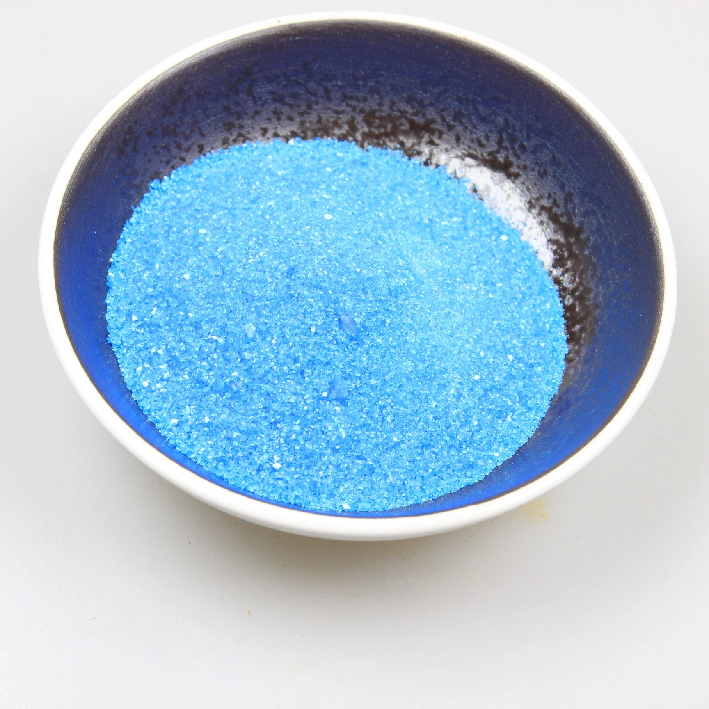
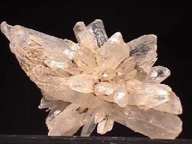

```{r setup, include=FALSE}
knitr::opts_chunk$set(echo = TRUE)
```

# Sool

## Lahustuvus

Paljud soolad lahustuvad vees hästi. Hästi lahustuvad aktiivsete metallide soolad.

# Tsinknitraat

## Valem

Zn(NO~3~)~2~

## Väljanägemine


## Temperatuurid

```{r}
MELTING_TEMPERATURE_ZNNITRATE <- 110 + 273.15
```

# Vasksulfaat

## Valem

CuSO~4~

## Väljanägemine



# Vaskvitriol

## Valem

$CuSO_4 \cdot 5 \cdot H_{2}O$

## Täpne nimetus

Copper(II) sulfate pentahydrate

## Väljanägemine


## Kasutus

patareide valmistamine

# Glaubrisool

## Valem

Na~2~SO~4~ * 10 * H~2~O

## Täpne nimetus

naatriumsulfaadi dekahüdraat

## Väljanägemine



## Looduses

1. soolavee allikad

2. kuivanud soolaste järvede ääres

## Reageerimine

Laguneb kuivas õhus:

Na~2~SO~4~ * 10 * H~2~O <-> Na~2~SO~4~ + 10 * H~2~O

## Kasutus

1. seedetegevuse hoogustamine