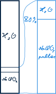
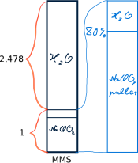
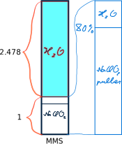

```{r setup, include=FALSE}
knitr::opts_chunk$set(echo = TRUE)
```

# Teadmiste kontrolli koostamine

## Reeglid

```{r}
MOLAR_MASS_H <- 1.008
MOLAR_MASS_O <- 15.999
MOLAR_MASS_CL <- 35.45
```


## Ülesande püstitus

Koosta 5 ülesandet, mille abil saaksid kontrollida:

1.  Teadmisi redoksprotsessi sisust arusaamise kohta.

2.  Teadmisi nii lahuste kui aine protsendilise koostise kohta.

3.  Prosendilise ja molaarse kontsentratsiooni omavahelise seose kohta.

4.  Moolide arvu, massi, ruumala ja aineosakeste seoste kohta läbi reaktsiooni võrrandi.

5.  Ülehulga ja saagise kohta mingi ühe ühendi mitme etapilises tootmisprotsessis.

## Lahendus

### Teadmisi redoksprotsessi sisust arusaamise kohta

1996\. aastal avastas üks mees nimega Jim Humble, et üks toona ülemaailmselt kasutuses olnud veepuhastamise vahend aitas seljatada malaariat. Kui esimesed malaariahaiged inimesed olid tervenenud, töötas Jim välja valemi, segamaks seda vahendit söögiks sobiliku happega ning nimetas selle Master Mineral Solutioniks (MMS). Tänapäevas on see valem tuntud kui MMS1, mille kohaselt pannakse omavahel reageerima naatriumklorit ja inimese kõhus leiduv maohape, mille tulemusena eraldub klorit. Sellest saadik on sajad tuhanded inimesed saanud MMS'i abil oma tervise osaliselt või täielikult korda mitte ainult malaariast, vaid paljudest haigustest. MMS on nõrk oksüdeerija, mis õigesti kasutatuna liigub läbi inimese keha hävitades haigustekitajaid ja mürke, mida nad toodavad, inimese keha kahjustamata. [@MMS]

Mina kasutasin MMS'i esmakordselt 2022. aastas välispidiselt saades ühe päevaga lahti valust põlves, hiljem reies, et saaksin taas joosta. Need valud ei naasnud. Hiljem hakkasin kasutama seda lahust hammastepuhastamiseks. Kui esinesid *Covid-19 omikron*i sümptomid, tegin läbi kolmandiku *Protocol 1000*, mille kohaselt tuli igapäevaselt lahust seesmiselt tarvitada iga tund kaheksa korda päevas 21 päeva järjest, millest mina pidasin vastu seitse ja pool päeva, enne kui selle lahuse tarbimine kasemahlaga mulle nii vastikuks muutus, et ma loobusin edasisest seespidisest tarvitamisest. Välispidiselt kasutasin seda ka siis ning juba ühe korra järel muutus nahk kestendavaks ja valuliseks, misjärel asendus see sileda ja puhta uue nahaga.

Mind hakkas huvitama, kuidas MMS1 keemilist reaktsiooni võrrandina kirja panna. See reaktsioon on algebraliselt selline:

$$\underbrace{NaClO_2}_{naatriumklorit} + \underbrace{HCl}_{maohape} \rightarrow \underbrace{ClO_2}_{klorit} + \underbrace{NaCl}_{lauasool} + \underbrace{H_2O}_{vesi}$$

See võrrand ei ole tasakaalus. Selles reaktsioonis osalevate elementide oksüdatsiooniastmed muutuvad, mistõttu on tegemist redoksreaktsiooniga. Järgnevalt tuleb see võrrand tasakaalustada.

Kirjutan selle reaktsiooni algebraliselt uuesti välja koos oksüdatsiooniastmetega:

$$Na^{1}\color{green}{Cl^{3}}O_2^{-2} + H^1\color{blue}{Cl^{-1}} \rightarrow \color{blue}{Cl^4}O_2^{-2} + Na^1\color{green}{Cl^{-1}} + H_2^1O^{-2}$$

Näen, et muutub kloori oksüdatsiooniaste:

$$\color{green}{Cl^3 + 4e \rightarrow Cl^{-1} | \cdot 5}$$

$$\color{blue}{Cl^{-1} -5e \rightarrow Cl^4 | \cdot 4}$$

Tasakaalustamiseks arvutan väikseima ühiskordaja tehetele elektronidega. Selleks on 20. Et saada neljast elektronist 20 elektroni, tuleb neli elektroni korrutada viiega. Et saada viiest elektronist 20 elektroni, tuleb viis elektroni korrutada neljaga.

$$\color{green}{5Cl^3 + 20e \rightarrow 5Cl^{-1}}$$

$$\color{blue}{4Cl^{-1} -20e \rightarrow 4Cl^4}$$

Panen esialgu ainult kloori ainetele vastavad kordajad reaktsiooniesildises ette:

$${\huge{\bf\color{green}{5}Na\color{green}{Cl}O_2} + {\bf\color{blue}{4}H\color{blue}{Cl}} \rightarrow {\bf\color{blue}{4Cl}O_2} + {\bf\color{green}{5}Na\color{green}{Cl}} + H_2O}$$

Naatriumi ained on tasakaalus. Kloori ained on tasakaalus. Et hapniku ained tasakaalu saada, tuleb vesi korrutada kahega:

$${\huge\color{green}{5}Na\color{green}{Cl}O_2 + \color{blue}{4}H\color{blue}{Cl} \rightarrow \color{blue}{4Cl}O_2 + \color{green}{5}Na\color{green}{Cl} + {\bf2H_2O}}$$

Ka vesiniku ained on tasakaalus, millega on moodustatud reaktsioonivõrrand. Seesama võrrand on esitatud ka kirjutises [@ALIVENHEALTHY].

### Teadmisi nii lahuste kui aine protsendilise koostise kohta

#### Ülesande püstitus

MMS on naatriumkloriti 23-% lahus. Seda saab ise valmistada, kui on olemas naatriumkloriti pulber või helbed. Võetakse see pulber või helbed ja lahjendatakse vees, nii et tekitatakse 80-% naatriumkloriti lahus. Selle tegemise protsessi ma siinkohal lähemalt ei kirjelda, kuna pole seda ise läbi teinud. Meenub, et tuleb kasutada ahju. Igatahes see 80-% lahus säilivat paarkümmend aastat. [@MMS_making] Võiks muidugi kohe teha 23-% lahuse, aga selle jaoks oleks ju rohkem ruumi vaja!

MMS'i valmistamiseks lisatakse sellele 80-% lahusele vett, nii et tekiks 23-% lahus. Mitu protsenti on MMS's nimetatud 80-% naatriumkloriti lahust? Mitmekordne 80-% naatriumkloriti lahuse kogus vett tuleb sellele lahusele lisada, et saada 23-% naatriumkloriti lahus ehk MMS?

Kui mul oleks kasutada kilogramm 80-% naatriumkloriti lahust, siis kui palju tuleks sellele kilogrammisele lahusele lisada vett, et tekitada MMS, ja kui suur oleks selle MMS'i koguse mass? Kui suurt anumat ma vajaksin selle koguse MMS'i jaoks? Vähemalt kui suures anumas peaks olema see nimetatud 80-% naatriumkloriti lahus? Kui suur on MMS'i tihedus?

#### Lahendus

##### Mitu protsenti on MMS's nimetatud 80-% naatriumkloriti lahust?

###### Joonis



###### Algandmed

esialgse 80-% naatriumkloriti lahuse osa lõpplahuses $naclo2\_protsente_{ll} = 23\%$

esialgse lahuse naatriumkloriti sisalduse osa $naclo2\_protsente_{al} = 80\%$

###### Mida arvutada?

naatriumkloriti 80-% lahuse osa protsentides lõpplahuses $lahus\_80_{ll} = ?$

###### Reegel

Naatriumkloritit, mida on esialgses lahuses 80%, peab lõpplahuses olema 23%. Huvitab, kui palju seda 80-% lahust on kokku lõpplahuses protsendimäärana. Seega vastab esialgse lahuse 100%-le küsimärk ja saan lasta välja arvutada 80-% naatriumkloriti lahuse protsendimäära lõpplahuses:

$$lahus\_80_{ll} = \frac{100 \cdot naclo2\_protsente_{ll}}{naclo2\_protsente_{al}},$$

kus *ll* on lõpplahus ja *al* alglahus.

###### Arvutamine

Lasen arvutada:

```{r}
solution_80_in_final_solution <- 100 * 23 / (80)
```

###### Lahend

Lõpplahuses on naatriumkloriti 80-% lahust `r solution_80_in_final_solution`%.

##### Mitmekordne 80-% naatriumkloriti lahuse kogus vett tuleb sellele lahusele lisada?

###### Joonis



###### Algandmed

naatriumkloriti 80-% lahuse osa lõpplahuses $lahus\_80_{ll} = `r solution_80_in_final_solution`\%$

###### Mida arvutada?

vee ja 80-% naatriumkloriti lahuse suhe lõpplahuses $vett\_esialgse\_lahuse\_kohta = ?$

###### Reegel

Küsimusele vastamiseks on vaja jagada lõpplahuse vee osamäär lõpplahuse põhiaine ehk 80-% naatriumkloriti lahuse osamääraga:

$$vett\_esialgse\_lahuse\_kohta = \frac{100 - lahus\_80_{ll}}{lahus\_80_{ll}}$$

###### Arvutamine

Lasen arvutada:

```{r}
water_ratio_to_starter_solution <- (100 - solution_80_in_final_solution) / solution_80_in_final_solution
```

###### Lahend

`r signif(water_ratio_to_starter_solution, digits <- 4)` osa vett tuleb võtta ühe osa esialgse 80-% naatriumkloriti lahuse kohta.

##### Kui palju vett tuleb lisada kilogrammisele 80-% naatriumkloriti lahusele, et saada MMS?

###### Joonis



###### Algandmed

80-% naatriumkloriti lahuse mass MMS's $mass_{80} = 1 \cdot kg$

```{r}
WEIGHT_80 <- 1
```

vee kordaja lõpplahuses 80-% naatriumkloriti lahuse kohta $kordaja_{vesi} = `r signif(water_ratio_to_starter_solution, digits <- 5)`$

###### Mida arvutada?

vee mass MMS's $mass_{vesi} = ?$

###### Reegel

```{=tex}
\begin{equation}
\frac{mass_{vesi}}{mass_{80}} === \frac{kordaja_{vesi}}{1}
(\#eq:weight-of-water-ratio-to-weight-of-80-percent-solution)
\end{equation}
```

Avaldan valemist \@ref(eq:weight-of-water-ratio-to-weight-of-80-percent-solution) vee massi:

```{=tex}
\begin{equation}
mass_{vesi} = mass_{80} \cdot kordaja_{vesi}
(\#eq:weight-of-water-in-mms)
\end{equation}
```

###### Arvutamine

```{r}
weight_water <- WEIGHT_80 * water_ratio_to_starter_solution
```

###### Lahend

`r signif(weight_water, digits <- 4)` * kg vett tuleb lisada ühele kilogrammile 80-% naatriumkloriti lahusele, et saada MMS.

##### Kui suur oleks MMS'i mass?

###### Algandmed

80-% naatriumkloriti lahuse mass $mass_{80} = 1 \cdot kg$

vee mass MMS's $mass_{vesi} = `r signif(weight_water, digits <- 5)` \cdot kg$

###### Mida arvutada?

MMS'i mass $mass_{mms} = ?$

###### Reegel

MMS'i massi arvutamises on vaja 80-% naatriumkloriti lahuse ja lisatud vee mass kokku liita:

$$mass_{mms} = mass_{80} + mass_{vesi}$$

###### Arvutamine

```{r}
weight_mms <- WEIGHT_80 + weight_water
```

###### Lahend

`r signif(weight_mms, digits <- 4)` * kg massib ühekilogrammisest 80-% naatriumkloriti lahusest tehtud MMS.

Seega on tõesti lihtsam hoiustada 80-% naatriumkloriti lahust ja vajadusel teha sellest MMS'i.

##### Vähemalt kui suures anumas peaks olema see nimetatud 80-% naatriumkloriti lahus?

###### Algandmed

80-% naatriumkloriti lahuse mass $mass_{80} = 1 \cdot kg$

naatriumkloriti osa 80-% naatriumkloriti lahuses $naclo2\_protsent_{al} = 80\%$

```{r}
PERCENTAGE_NACLO2_STARTER <- 80
```

Tihedused tuleb otsida internetist.

naatriumkloriti tihedus $\rho_{NACLO2} = 2.5 \cdot \frac{g}{cm^3} === 2.5 \cdot 10^{3} \cdot \frac{kg}{m^3}$ [@NaClO2]

vee tihedus nt temperatuuril 21°C, sest umbes sellise temperatuuriga keskkonnas segaksin ained kokku, $\rho_{VESI} = .99802 \cdot \frac{g}{cm^3} === 9.9802 \cdot 10^{2} \cdot \frac{kg}{m^3}$ [@water]

```{r}
DENSITY_WATER <- 9.9802E2
```

###### Mida arvutada?

ühe kilogrammi 80-% naatriumkloriti lahuse ruumala $ruumala_{al} = ?$

###### Reeglid

80-% naatriumkloriti lahuse ruumala arvutamiseks on vaja kokku liita selles lahuses oleva naatriumkloriti ruumala ja selles lahuses oleva vee ruumala.

Tuleb välja selgitada naatriumkloriti osa 80-% lahuses grammides:

```{=tex}
\begin{equation}
naclo2\_mass_{al} = mass_{80} \cdot \frac{naclo2\_protsent_{al}}{100}
(\#eq:weight-of-naclo2-in-starter)
\end{equation}
```

Järgmisena saan naatriumkloriti tiheduse kaudu välja arvutada naatriumkloriti ruumala kasutades naatriumkloriti massi valemist \@ref(eq:weight-of-naclo2-in-starter):

```{=tex}
\begin{equation}
naclo2\_ruumala_{al} = \frac{mass_{80} \cdot naclo2\_protsent_{al}}{\rho_{NACLO2} \cdot 100}
(\#eq:volume-of-naclo2-in-starter)
\end{equation}
```

80-% naatriumkloriti lahuse vee ruumala tuleb liita naatriumkloriti ruumalale, mille jaoks lõin valemi \@ref(eq:volume-of-naclo2-in-starter):

```{=tex}
\begin{equation}
ruumala_{al} = \frac{mass_{80} \cdot naclo2\_protsent_{al}}{\rho_{NACLO2} \cdot 100} + \frac{mass_{80} \cdot \frac{(100 - naclo2\_protsent_{al})}{100}}{\rho_{VESI}} ===\\
\frac{mass_{80} \cdot naclo2\_protsent_{al}}{\rho_{NACLO2} \cdot 100} + \frac{mass_{80} \cdot (100 - naclo2\_protsent_{al})}{\rho_{VESI} \cdot 100}
(\#eq:volume-of-starter)
\end{equation}
```

###### Arvutamine

```{r}
volume_naclo2_80 <- WEIGHT_80 * PERCENTAGE_NACLO2_STARTER / (2.5e3 * 100) + WEIGHT_80 * (100 - PERCENTAGE_NACLO2_STARTER) / (DENSITY_WATER * 100)
```

###### Lahend

Ühe kilogrammi 80-% naatriumkloriti lahuse hoiustamiseks on vaja nõud suurusega `r signif(volume_naclo2_80, digits <- 5)` * m^3^.

##### Kui suurt anumat ma vajaksin selle koguse MMS’i jaoks?

###### Algandmed

ühe kilogrammi 80-% naatriumkloriti lahuse ruumala $ruumala_{al} = `r signif(volume_naclo2_80, digits <- 6)` \cdot m^3$

MMS'i vee, mis on lisatud ühele kilogrammile 80-% naatriumkloriti lahusele, ruumala $mass_{vesi} = `r signif(weight_water, digits <- 5)` \cdot kg$

vee tihedus nt temperatuuril 21°C, sest umbes sellise temperatuuriga keskkonnas segaksin ained kokku, $\rho_{VESI} = .99802 \cdot \frac{g}{cm^3} === 9.9802 \cdot 10^{2} \cdot \frac{kg}{m^3}$ [@water]

###### Mida arvutada?

MMS'i ruumala $ruumala_{mms} = ?$

###### Reeglid

Tuleb lisada MMS'i vee ruumala 80-% naatriumkloriti lahuse ruumalale MMS's, millest viimase arvutan valemiga \@ref(eq:volume-of-starter) ja esimese massi juba lasin arvutada valemi \@ref(eq:weight-of-water-in-mms) järgi:

```{=tex}
\begin{equation}
ruumala_{ll} = ruumala_{al} + \frac{mass_{vesi}}{\rho_{VESI}}
(\#eq:volume-of-mms)
\end{equation}
```

###### Arvutamine

```{r}
volume_mms <- volume_naclo2_80 + weight_water / DENSITY_WATER
```

###### Lahend

Nõud, mille maht on vähemalt $`r signif(volume_mms, digits <- 5)` \cdot m^3$, on vaja ühest kilogrammist naatriumkloritist valmistatud MMS'i hoiustamiseks.

##### Kui suur on MMS'i tihedus?

###### Algandmed

ühest kilogrammist 80-% naatriumkloriti lahusest tehtud MMS'i mass $mass_{mms} = `r signif(weight_mms, digits <- 5)` \cdot kg$

ühest kilogrammist 80-% naatriumkloriti lahusest tehtud MMS'i ruumala $ruumala_{ll} = `r volume_mms` \cdot m^3$

###### Mida arvutada?

MMS'i tihedus $tihedus_{ll} = ?$

###### Reegel

$$tihedus_{ll} = \frac{mass_{mms}}{ruumala_{ll}}$$

###### Arvutamine

```{r}
density_mms <- weight_mms / volume_mms
```

###### Lahend

MMS'i tihedus on $`r signif(density_mms, digits <- 5)` \cdot \frac{kg}{m^3}$.

###

MMS1 kokkusegamiseks on vaja võtta kolm tilka 23-% naatriumkloriti lahust ja kolm tilka 4-% maohappe lahust. Seejärel oodatakse pool minutit, kuni segu muutub tumekollaseks. Sellist värvumist nimetatakse naatriumkloriti aktiveerimiseks. Tulemusena eraldub 20 * mg kloritit. Keemik Tomas Horky olevat väitnud, et ühe tilga ruumiline maht olevat .042 * ml. Kontrollin arvutuslikult, kas see väide on tõese sisuga.

Esmalt kirjutan välja reaktsioonivõrrandi:

$${5}Na{Cl}O_2 + {4}H{Cl} \rightarrow {4Cl}O_2 + {5}Na{Cl} + 2H_2O$$

Lasen arvutada kloriti molaarmassi:

```{r}
molar_mass_clo2 <- MOLAR_MASS_CL + MOLAR_MASS_O * 2 
```

Kloriti molaarmass on $`r molar_mass_clo2` \cdot \frac{g}{mol}$.

Lasen arvutada kloriti ainehulga:

```{r}
moles_clo2 <- 20e-3 / molar_mass_clo2
```

Kloriti moolide hulk on `r moles_clo2`.

Vastavalt võrrandile on kasutatud maohapet sama palju kui on eraldunud kloritit. Seega on maohapet ka `r moles_clo2` * mooli.

Lasen arvutada maohappe molaarmassi:

```{r}
molar_mass_hcl <- MOLAR_MASS_H + MOLAR_MASS_CL
```

Maohappe molaarmass on $`r molar_mass_hcl` \cdot \frac{g}{mol}$.

Kuna inimesed segavad need ained kokku normaaltingimustel, siis lasen vastavalt normaaltingimustele arvutada maohappe massi:

Lasen arvutada maohappe massi:

```{r}
mass_hcl <- moles_clo2 * molar_mass_hcl
```

Maohappe mass on `r mass_hcl` * g. See on lahusest 4%. Lasen arvutada


Reaktsioonivõrrandis on kõiki aineid 100%. 

### Prosendilise ja molaarse kontsentratsiooni omavahelise seose kohta

### Moolide arvu, massi, ruumala ja aineosakeste seoste kohta läbi reaktsiooni võrrandi

### Ülehulga ja saagise kohta mingi ühe ühendi mitme etapilises tootmisprotsessis
