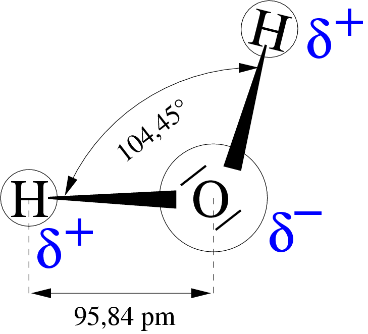

# Vesi

## Valem

H~2~O

## Täpne nimetus

divesinikoksiid

## Molekul



## Tihedus

```{r}
DENSITY_WATER <- .998E-3 / 1E-6
```

## Sulamistemperatuur

```{r}
MELTING_TEMPERATURE_WATER <- 273.15
```

## Aurustumistemperatuur

```{r}
VAPORISING_TEMPERATURE_WATER <- 100 + 273.15
```

## Isomeerid

1. paravesi

2. ortovesi

## Isomeerid

1. H~2~O

2. HDO

3. D~2~O

4. T~2~O

## Looduses

Looduslikult puhast vett esineb harva. Enamasti sisaldab see gaase, soolasid ja orgaanilisi ühendeid.

## Saamine

1. vesiniku ja õhu segu plahvatades

2. autotroofsed prokarüootsed väävlibakterid toodavad:

$$18 \cdot H_2S + 6 \cdot CO_2 \xrightarrow{valgus} C_6H_{12} + 12 \cdot H_2O + 18 \cdot S$$

## Reageerimine

1. Sinibakterid ja kõik autotroofsetele prokarüootsetele väävlibakteritele järgnevad autotroofsed eukarüoodid toodavad glükoosi ning rikastavad nii vett kui atmosfääri hapnikuga:

$$6 \cdot CO_2 + 12 \cdot H_2O \xrightarrow{valgus} C_6H_{12}O_6 + 6 \cdot O_2 + 6 \cdot H_2O$$

2. rakuhingamine:

C~6~H~12~O~6~ + 6 * O~2~ -> 6 * H~2~O + 6 * CO~2~

## Kasutus

1. vesinik kui energiaallikas:

2 * H~2~O -> 2 * H~2~ + O~2~

2. religioonsetes toimingutes

3. väekohtade otsimises

4. dekoratiivelemendina

5. joomiseks

6. farmaatsias infusioonideks ja süstideks

7. auruna köharavis

8. pesemiseks

9. põllumajanduses

10. kalad elukeskkonnana

11. veekogudena transpordis

12. tööstuses

13. soojendamiseks

14. auruturbiini ringiajamiseks

15. jahutamiseks

16. külmana hoidmiseks

17. lahustamiseks

18. käimlas

19. söögivalmistamises

20. lõikamises

21. ainevahetuses

22. konnade ja kalade kaitsekilena

23. selgrootute ja taimede liikumiseks

24. vesiveskites ja veeturbiinides

25. iglude ehitamiseks

26. heli ülekandmiseks

27. libestamiseks

28. tihendamiseks

29. vesijooksik veel liikumiseks

30. seebimullid

31. rõhu ülekandmiseks

32. tasakaalustamiseks

33. akutehnikas

34. puidu pehmendamiseks

35. infrapunase valguse filterdamiseks

36. aatomi elektrijaamade ioniseeriva kiirguse absorbeerijana

37. veekahurites
